# Thalamus & Sweep — Agentic systems portfolio

Two production agentic backends I designed and shipped, extracted and trimmed so the design can be read end-to-end.

Two complementary patterns on a shared typed foundation:

- **Thalamus** — multi-cortex research agent. Decomposes an open question into specialized cortices, plans tool calls, explores sources in parallel via a nano-model swarm, synthesizes, and writes structured findings to a knowledge graph.
- **Sweep** — continuous knowledge-base auditor with human-in-the-loop. A nano-model swarm scans the DB for inconsistencies, drafts resolutions, surfaces them to a reviewer UI, and uses accept/reject signals to tune the next run.

Producer / maintainer halves of the same knowledge loop: Thalamus creates, Sweep maintains.

> h The architecture is domain-agnostic. Illustrated below on a critical-system use case — orbital collision avoidance, where a false negative ends in a Kessler cascade and a false positive burns a satellite's delta-v budget — ten transposed to Threat Intelligence, Pharmacovigilance and maritime surveillance with the same orchestrator, swarm, and HITL loop.

## Design stance

The shape of the problem matters more than the domain. A few positions this repo takes, and where they come from:

- **The LLM as a kernel, not an application.** The orchestrator is the OS; cortices are processes; tools are syscalls; prompts are binaries on disk. This is Karpathy's "LLM OS" framing made concrete — the model is one scheduled component in a system with memory, tools, budgets and a userland, not the whole product. (See Karpathy, _Intro to LLMs_, 2023; _Software 2.0_, 2017, for the programs-as-weights reframe that justifies treating prompts as versioned artifacts.)
- **Swarms of small models beat one big one for retrieval.** Up to 50 nano workers crawl and summarize in parallel; a stronger curator dedupes and ranks. Orders of magnitude cheaper than a single strong model per source, bounded latency, easier to cap. The intuition tracks Karpathy's nanoGPT/"small models, big fleet" thread, and the systems work on mixture-of-experts routing (Shazeer et al., _Outrageously Large Neural Networks_, 2017; Fedus et al., _Switch Transformer_, 2021) applied at the orchestration layer rather than inside the network.
- **Bounded agents, not free-form ones.** Every cortex declares its skills, tools, cost budget and depth cap. Guardrails live in the orchestrator, in code, not in prompts. Closer in spirit to Park et al.'s _Generative Agents_ (2023) constrained-planner pattern and Yao et al.'s _ReAct_ (2022) than to open-ended auto-GPT loops.
- **Deterministic layer beneath the LLMs.** Drizzle ORM, typed repositories, transactional resolutions, structured findings. The model drafts; the system commits. No ad-hoc SQL from the agent. Same discipline Simon Willison keeps writing about — LLMs as untrusted input generators, everything downstream strongly typed.
- **Human-in-the-loop as a first-class citizen.** Sweep is designed around a reviewer, not around autonomy. Accept/reject signals on findings feed back into the next swarm run's prompt per category. Poor-man's RLHF in the Christiano/Ouyang lineage (_Deep RL from Human Preferences_, 2017; _InstructGPT_, 2022), practical and cheap — calibration without a training run.
- **Observability from day one.** Structured logs, Prometheus counters, per-step traces. Cost and latency instrumented per cortex, per source, per skill. Chip Huyen's _Designing Machine Learning Systems_ stance: if you can't see it, you don't run it.
- **Skills as files, not strings.** Each skill is a markdown prompt versioned with the code. Diffable in PRs, reviewable by non-engineers. The _Software 2.0_ corollary: when the program is a prompt, treat it like source.
- **Testability end-to-end.** 5-layer architecture, Drizzle-typed repos, isolated services, vitest workspace with unit / integration / e2e.

## Layout

```
packages/
  shared/       Cross-cutting: tryAsync, AppError, enums, observability, normalizers
  db-schema/    Drizzle ORM schema + typed query helpers
  thalamus/     Research agent: cortices, orchestrator, explorer/swarm, skills
  sweep/        Auditor: nano-swarm, resolution service, admin routes, BullMQ jobs
```

Conventional 5-layer backend inside each feature package: `routes → controllers → services → repositories → entities`. No business logic in controllers or repositories. No `any`/`unknown` in repo signatures — Drizzle-inferred types all the way up.

## Thalamus — multi-cortex research agent

Entry point: [packages/thalamus/src/orchestrators/executor.ts](packages/thalamus/src/orchestrators/executor.ts)

```
Query
  │
  ▼
Orchestrator ──► Registry ──► select cortex (by query shape)
                    │
                    ├──► Cortex.executor(query)
                    │       ├── plan tool calls (skill prompt)
                    │       ├── dispatch Explorer (nano swarm + source fetchers)
                    │       └── write structured entities to knowledge graph
                    │
                    └──► Guardrails (cost, depth, hallucination checks)
```

- **Cortices** (`src/cortices/`) — one folder per domain of expertise, each owning its SQL helpers and skill prompts. Adding a new capability = a new folder, not a new branch in a god-function.
- **Explorer** (`src/explorer/`) — parallel retrieval: up to 50 `gpt-5.4-nano` workers crawl and summarize, a stronger curator dedupes and ranks. ~10× cheaper than a single strong model per source, bounded latency, easier to cap.
- **Skills as prompts on disk** (`cortices/skills/*.md`) — each skill is a markdown file, versioned with the code. Reviewable, diffable, auditable by non-engineers (analysts, compliance).
- **Source fetchers** (`cortices/sources/`) — one per external system, behind a typed `SourceFetcher` interface. Swappable and mockable.
- **Knowledge graph write-path** — entities land in Postgres (Drizzle + pgvector) through repositories, never ad-hoc SQL from the agent. Vector search for semantic retrieval across findings.

## Sweep — DB audit + reviewer loop

Entry point: [packages/sweep/src/services/nano-sweep.service.ts](packages/sweep/src/services/nano-sweep.service.ts)

```
Cron / admin trigger
       │
       ▼
NanoSweep.service ──► gpt-5.4-nano swarm ──► finding-routing ──► Redis (pending)
                                                                    │
                                                                    ▼
                                                            Reviewer UI
                                                                    │
                                                        accept / reject / edit
                                                                    │
                                                                    ▼
                                                  Resolution.service ──► DB write + audit row
                                                                    │
                                                                    ▼
                                                          feedback → prompt tuning
```

- **Nano swarm** scans records for missing fields, inconsistencies, suspect classifications, stale entries — in parallel, rate-limited, budgeted.
- **Findings** persist to Redis with dedup and rate limits before reaching the reviewer.
- **Resolution service** applies accepted changes inside a transaction, always with an audit trail. No silent writes. Every mutation reversible.
- **Feedback** on accept/reject feeds back into the next swarm run's prompt per category. The system gets calibrated to the reviewer's standards without fine-tuning.
- **Editorial copilot** reuses the same pipeline to draft structured briefings from audited data.
- **Catalog enrichment pipeline** (April 2026) extends Sweep with two fill paths, both emitting navigable findings in the knowledge graph:
  - **Web mission** (gpt-5.4-nano + `web_search`) — structured-outputs JSON schema + hedging-token blocklist + source-URL validation + per-column range guards + unit mismatch check + 2-vote corroboration. Per-satellite granularity (name + NORAD id in the prompt), payload-only filter.
  - **KNN propagation** (zero-LLM) — for each payload missing a field, finds K nearest embedded neighbours (Voyage halfvec cosine) with the field set and propagates their consensus value. ±10 % agreement requirement on numeric, ⅔ mode coverage on text.
  - Every fill emits a `research_finding` (`cortex=data_auditor`, `finding_type=insight`) with `research_edge`s — `about` → target, `similar_to` → neighbours / cited URL. Cortices can now cite and reason on factual fills.
- **Orbital reflexion pass** — second-pass anomaly detector that cross-tabulates a suspect satellite's orbital fingerprint (inclination, RAAN, mean motion) against the declared classification. Surfaces military-lineage peers (Yaogan, Cosmos, NROL, Shiyan, …) sharing the same inclination belt. Emits `anomaly` findings with navigable provenance. Pure SQL, no LLM. Live verified on FENGYUN 3A.
- **Autonomy loop** — `POST /api/autonomy/start` rotates Thalamus cycles (6 rotating SSA queries) with Sweep null-scans; topbar pill + FEED panel stream each tick live in the console.

## Primary build — Space Situational Awareness

Collision avoidance in orbit is the archetypal dual-stream critical-system loop. Noisy open catalogs and amateur observations vs. high-trust classified radars. An operator in the loop before any maneuver. Confidence thresholds that trigger money (delta-v) and avoid Kessler cascades.

```
OSINT stream (CelesTrak TLE, amateur observers, press, operator socials)
              │
              ▼
      catalog cortex ── hypothesis conjunctions (conf 0.2–0.5)
              │
              ▼
    correlation cortex ◄──── Field stream (classified tracking radars,
              │                                 operator ephemerides, telemetry)
              ▼
    ConjunctionEvent (probability of collision + confidence band)
              │
    ┌─────────┴─────────┐
    ▼                   ▼
  P ≥ 10⁻⁴           P < 10⁻⁴
    │                   │
    ▼                   ▼
  Sweep finding      logged, no alert
    │
    ▼
  mission operator ── accept → burn command + audit row
                  └─ reject → keep monitoring
```

**Cortices**

- `catalog` — TLE / ephemeris ingestion, orbital propagation
- `observations` — radar + optical tracking data normalization
- `conjunction-analysis` — close-approach screening with confidence bands
- `correlation` — dual-stream fusion (public catalog × classified radar tracks)
- `maneuver-planning` — burn windows, delta-v budget, post-maneuver conjunction re-check

**Entities** `Satellite`, `Debris`, `Observation`, `ConjunctionEvent`, `Maneuver`

**HITL = mission operator.** Every `ConjunctionEvent` above threshold (P(collision) ≥ 10⁻⁴, standard NASA convention) becomes a Sweep finding. The operator validates or rejects before any burn is committed. Audit row per decision — the `Maneuver` ledger is reversible-by-design (a burn can be computed back from the audit trail if it needs to be reconstructed post-incident).

**Why a platform, not a product:** any org running space assets — operators, agencies, earth-observation primes, secure-comms providers — has a variant of this loop. The platform industrializes it once (orchestrator, swarm, guardrails, HITL, audit); each tenant plugs its own catalog sources, radar feeds, and thresholds behind the same `SourceFetcher` interface.

**Dual-stream properties, by construction:**

- OSINT edges start at `confidence ∈ [0.2, 0.5]` (TLEs are days-stale, amateurs miss small debris).
- Field corroboration from a classified radar raises confidence to `[0.85, 1.0]`.
- Absence of field signal keeps the edge flagged — an operator sees the provenance breakdown before acting.
- A hypothesis conjunction can never promote itself to actionable without field corroboration. Guardrail is in code, not in the prompt.

This is exactly the shape defined in [SPEC-TH-040 `dual-stream-confidence`](docs/specs/thalamus/dual-stream-confidence.tex) and [SPEC-TH-041 `field-correlation`](docs/specs/thalamus/field-correlation.tex) — the specs were written to fit this use case.

## One-step transposition — Threat Intelligence

Swap the schema, the skill prompts, and the source fetchers. Everything else is unchanged.

| SSA component                                      | Threat Intel equivalent                                                                                  |
| -------------------------------------------------- | -------------------------------------------------------------------------------------------------------- |
| `catalog` cortex                                   | `vulnerability-catalog` cortex (CVE / advisory ingestion)                                                |
| `observations` cortex                              | `ioc-normalization` cortex                                                                               |
| `conjunction-analysis` cortex                      | `threat-screening` cortex                                                                                |
| `correlation` cortex                               | `dual-stream-correlation` cortex (OSINT × field/classified)                                              |
| `maneuver-planning` cortex                         | `response-planning` cortex (containment, counter-action)                                                 |
| OSINT sources: TLE, amateur obs, press             | OSINT sources: NVD, STIX/TAXII, CERT-FR/ANSSI, MITRE ATT&CK, press, socials                              |
| Field sources: tracking radars, operator telemetry | Field sources: tactical data-link, sensor-fusion bus, mission debrief, friendly-force tracking, C2 feeds |
| `ConjunctionEvent` entity                          | `ThreatEvent` entity                                                                                     |
| `Maneuver` entity                                  | `Response` entity                                                                                        |
| Threshold P(collision) ≥ 10⁻⁴                      | Threshold severity × exploitability × exposure                                                           |
| Mission operator reviewer                          | Threat analyst reviewer                                                                                  |
| Burn command audit                                 | Response action audit                                                                                    |

Same orchestrator. Same cortex pattern. Same 50-nano swarm. Same HITL sweep. Same guardrails. Same confidence/source-class edge metadata. The transposition is a schema rename and a new fetcher bundle — not an architectural change. **Ship the platform once, plug a domain per tenant.**

## Other transpositions (available on request)

- **Pharmacovigilance** — PubMed / social (OSINT) × FAERS / EudraVigilance (Field), reviewer = pharmacovigilance officer. HITL is regulatory (EMA good practice), not negotiable.
- **Illegal-fishing / IUU maritime surveillance** — press / NGO reports (OSINT) × AIS + SAR satellite imagery (Field), reviewer = coast-guard analyst.
- **Regulatory & export-control monitoring** — open filings / press (OSINT) × customs / sanctions registries (Field), reviewer = compliance officer.

Each uses the same `docs/specs/` contracts. Each is a schema + skill-pack swap. None requires a new orchestrator, a new swarm, or a new HITL loop.

## Shared foundation

- `@interview/shared` — `tryAsync` (Go-style error tuples), `AppError` hierarchy with structured causes, observability (`createLogger`, `MetricsCollector`), domain-agnostic normalizers, completeness scoring with adaptive weight normalization.
- `@interview/db-schema` — Drizzle ORM schema + typed query helpers. One source of truth for entity shapes across Thalamus and Sweep.
- Types flow end-to-end. Repo signatures use Drizzle-inferred types; services compose DTOs; the LLM layer consumes Zod-validated inputs.

## Design choices worth discussing

1. **Cortex pattern over a single "research agent"** — each cortex owns its tools, skills, SQL helpers. Isolated blast radius, parallel development, trivially testable.
2. **Swarm of nanos over a single strong model** — parallel cheap retrieval, stronger curator on the back end. Orders of magnitude cheaper, bounded latency, easier to cap.
3. **Skills as files, not strings** — version control for prompts, diffable in PRs, reviewable by analysts and compliance.
4. **Redis-backed findings with explicit review step** — Sweep doesn't write blindly. The human is part of the control loop, not an exception path.
5. **Repo = queries, service = logic** — strict separation. Repos do targeted joins; services aggregate and enforce rules. Layers are independently testable.
6. **Monorepo over two services** — shared types and schema are load-bearing. Versioning two npm packages would have bought pain, not isolation.
7. **Guardrails in code, not in prompts** — cost caps, depth limits, hallucination checks live in the orchestrator. The LLM cannot silently exceed its budget or leak sensitive data.
8. **Multi-provider by construction** — per-step model selection. Strong models on planning/synthesis, long-context open models (Kimi, Mistral, LLaMA) on reasoning, fleets of cheap nanos on retrieval. Nothing assumes a single vendor; sensitive workloads can be pinned to self-hosted weights without touching the orchestrator.

## References

- Karpathy, A. — _Software 2.0_ (2017); _Intro to Large Language Models_ (2023); nanoGPT (2022–).
- Shazeer et al. — _Outrageously Large Neural Networks: The Sparsely-Gated Mixture-of-Experts Layer_ (2017).
- Fedus, Zoph, Shazeer — _Switch Transformer_ (2021).
- Yao et al. — _ReAct: Synergizing Reasoning and Acting in Language Models_ (2022).
- Park et al. — _Generative Agents: Interactive Simulacra of Human Behavior_ (2023).
- Christiano et al. — _Deep Reinforcement Learning from Human Preferences_ (2017).
- Ouyang et al. — _Training Language Models to Follow Instructions with Human Feedback_ (InstructGPT, 2022).
- Huyen, C. — _Designing Machine Learning Systems_ (O'Reilly, 2022).
- Willison, S. — writing on LLM tool use, prompt injection, and typed boundaries (simonwillison.net, 2023–).

## Running locally

```bash
pnpm install
pnpm -r typecheck   # all packages
pnpm test           # vitest workspace (unit / integration / e2e)
pnpm run ssa        # conversational CLI (Ink REPL — see §SSA console below)
```

## SSA console — `pnpm run ssa`

Interactive terminal REPL (`@interview/cli`) with two-lane routing: explicit
slash commands bypass the LLM (`parseExplicitCommand`), free-text goes
through the `interpreter` cortex which emits a Zod-validated
`RouterPlan { steps[1..8], confidence }`. Ambiguous input triggers a
`clarify` step instead of guessing.

Commands:

- `/query <text>` — run a Thalamus cycle, render briefing
- `/telemetry <satId>` — spawn telemetry swarm, render 14-scalar distribution
- `/logs [level=info] [service=*]` — tail in-process pino ring buffer
- `/graph <entity>` — BFS neighbourhood in `research_edge`
- `/accept <suggestionId>` — resolve a sweep suggestion (audited)
- `/explain <findingId>` — ASCII provenance tree (finding → edges →
  source_item + skill sha256)

Rendering:

- Editorial tight layout (pretext-flavored quote bubbles, confidence
  sparklines, source-class colors: FIELD=green, OSINT=yellow, SIM=gray).
- Animated emoji lifecycle logs at 6 fps (frames for in-progress, terminal
  emoji freeze on done/error).
- ASCII satellite loader with rolling p50/p95 ETA per `{kind, subject}`,
  persisted to `~/.cache/ssa-cli/eta.json`.
- Persistent status footer: `session · tokens k/400k · cost $X · last: …`.

Current boot is stub mode (`buildRealAdapters` throws for thalamus /
telemetry / graph / resolution / why — real infra wiring pending). The
`logs` adapter is real (pino ring buffer). Injectable adapters via
`BootDeps` power the e2e test.

# Thalamus & Sweep — Agentic Systems Portfolio

> **Two production agentic backends. One shared typed foundation.**
> Thalamus creates knowledge. Sweep maintains it. Together they close the loop.

---

## Ontology

<!-- Context-engineering block: explicit vocabulary for both human readers and LLM consumers. -->
<!-- Every term below is used consistently throughout the document. -->

| Term               | Definition                                                                                                               |
| ------------------ | ------------------------------------------------------------------------------------------------------------------------ |
| **Cortex**         | A domain-specialized execution unit. Owns its tools, skill prompts, SQL helpers, and cost budget. Isolated blast radius. |
| **Skill**          | A markdown prompt file, versioned with the code. The "binary" the cortex runs.                                           |
| **Nano worker**    | A cheap, fast model instance (e.g. `gpt-5.4-nano`) doing bounded retrieval or classification in a swarm.                 |
| **Curator**        | A stronger model that deduplicates, ranks, and synthesizes nano worker outputs.                                          |
| **Finding**        | A structured observation (inconsistency, threat, conjunction) surfaced by the swarm, pending human review.               |
| **Resolution**     | A transactional DB write triggered by an accepted finding. Always audited, always reversible.                            |
| **HITL**           | Human-in-the-loop. The reviewer is a first-class system component, not an exception path.                                |
| **Dual-stream**    | OSINT (low-confidence, high-volume) fused with Field (high-confidence, restricted). Confidence is never self-promoted.   |
| **Source fetcher** | A typed adapter behind the `SourceFetcher` interface. One per external system. Swappable, mockable.                      |

---

## System topology

The two subsystems share a typed foundation and form a closed knowledge loop: Thalamus writes to the knowledge graph, Sweep audits it, human decisions refine both.

```mermaid
%%{init: {'theme': 'base', 'themeVariables': {'primaryColor': '#1a1a2e', 'primaryTextColor': '#e0e0e0', 'lineColor': '#4cc9f0', 'secondaryColor': '#16213e', 'tertiaryColor': '#0f3460'}}}%%

flowchart TB
    subgraph FOUNDATION["@interview/shared + @interview/db-schema"]
        direction LR
        tryAsync["tryAsync\n(Go-style error tuples)"]
        AppError["AppError hierarchy\n(structured causes)"]
        Observability["Observability\n(logger, metrics, traces)"]
        Drizzle["Drizzle ORM\n(typed schema + repos)"]
        Zod["Zod validation\n(LLM I/O boundary)"]
    end

    subgraph THALAMUS["Thalamus — Research Agent"]
        direction TB
        Orch["Orchestrator"]
        Registry["Cortex Registry"]
        Cortices["Cortices\n(domain-specialized)"]
        Explorer["Explorer\n(nano swarm ×50)"]
        Curator["Curator\n(strong model)"]
        KG["Knowledge Graph\n(Postgres + pgvector)"]

        Orch -->|"select by query shape"| Registry
        Registry -->|"dispatch"| Cortices
        Cortices -->|"plan tools + spawn"| Explorer
        Explorer -->|"raw summaries"| Curator
        Curator -->|"ranked findings"| KG
    end

    subgraph SWEEP["Sweep — Auditor + HITL"]
        direction TB
        Cron["Cron / Admin trigger"]
        NanoSweep["NanoSweep service\n(nano swarm)"]
        Redis["Redis\n(pending findings)"]
        ReviewerUI["Reviewer UI"]
        Resolution["Resolution service\n(transactional writes)"]
        Feedback["Feedback loop\n(prompt tuning)"]

        Cron --> NanoSweep
        NanoSweep -->|"deduped findings"| Redis
        Redis --> ReviewerUI
        ReviewerUI -->|"accept / reject / edit"| Resolution
        Resolution -->|"audit row + DB write"| Feedback
    end

    THALAMUS -->|"writes entities"| KG
    KG -.->|"audited by"| SWEEP
    Feedback -.->|"calibrates next run"| NanoSweep
    FOUNDATION --- THALAMUS
    FOUNDATION --- SWEEP

    style FOUNDATION fill:#0d1117,stroke:#30363d,color:#e6edf3
    style THALAMUS fill:#161b22,stroke:#4cc9f0,color:#e6edf3
    style SWEEP fill:#161b22,stroke:#f72585,color:#e6edf3
```

---

## Design stance

The LLM is a kernel, not an application. The orchestrator is the OS; cortices are processes; tools are syscalls; prompts are binaries on disk.

```mermaid
%%{init: {'theme': 'base', 'themeVariables': {'primaryColor': '#1a1a2e', 'lineColor': '#4cc9f0'}}}%%

flowchart LR
    subgraph ANALOGY["LLM-as-Kernel analogy"]
        direction TB
        OS["Orchestrator = OS"]
        Proc["Cortex = Process"]
        Sys["Tool = Syscall"]
        Bin["Skill prompt = Binary on disk"]
        Mem["Knowledge graph = Filesystem"]
        Guard["Guardrails = Kernel enforced limits"]
    end

    subgraph PRINCIPLES["Non-negotiable constraints"]
        direction TB
        P1["Guardrails live in CODE,\nnever in prompts"]
        P2["LLM output = untrusted input\n(Willison principle)"]
        P3["Human reviewer = first-class\nsystem component"]
        P4["No ad-hoc SQL from agents.\nDrizzle-typed repos only."]
        P5["Every mutation audited,\nevery mutation reversible"]
    end

    ANALOGY --- PRINCIPLES
```

**Positions and lineage:**

| Position                                        | Source                                                                                        |
| ----------------------------------------------- | --------------------------------------------------------------------------------------------- |
| LLM as scheduled kernel component               | Karpathy, _Intro to LLMs_ (2023), _Software 2.0_ (2017)                                       |
| Swarm of nanos > one strong model for retrieval | nanoGPT thread; Shazeer et al. _MoE_ (2017); Fedus et al. _Switch Transformer_ (2021)         |
| Bounded agents, not free-form                   | Park et al. _Generative Agents_ (2023); Yao et al. _ReAct_ (2022)                             |
| Deterministic layer beneath LLMs                | Willison — LLMs as untrusted input generators, typed boundaries                               |
| HITL as first-class citizen                     | Christiano et al. _Deep RL from Human Preferences_ (2017); Ouyang et al. _InstructGPT_ (2022) |
| Observability from day one                      | Huyen, _Designing ML Systems_ (2022)                                                          |
| Skills as files, not strings                    | _Software 2.0_ corollary — prompts are source, treat them as such                             |

---

## Thalamus — Multi-cortex research agent

### Orchestration sequence

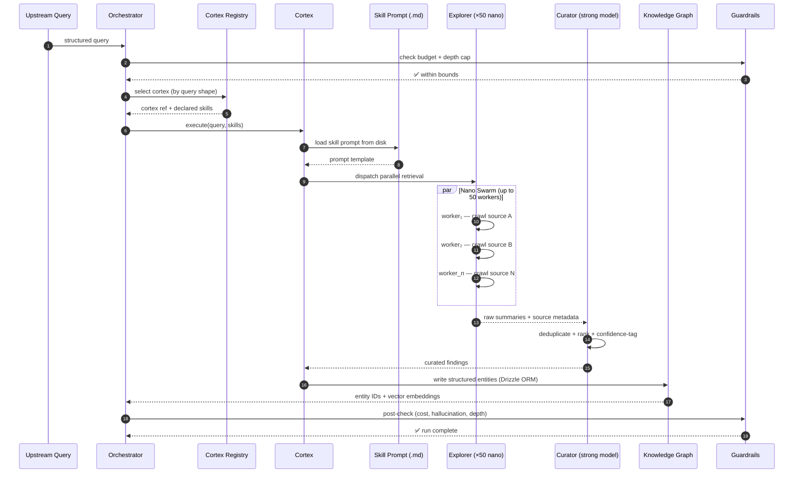

### Cortex anatomy

Each cortex is a self-contained folder. Adding a capability means adding a folder, not editing a god-function.

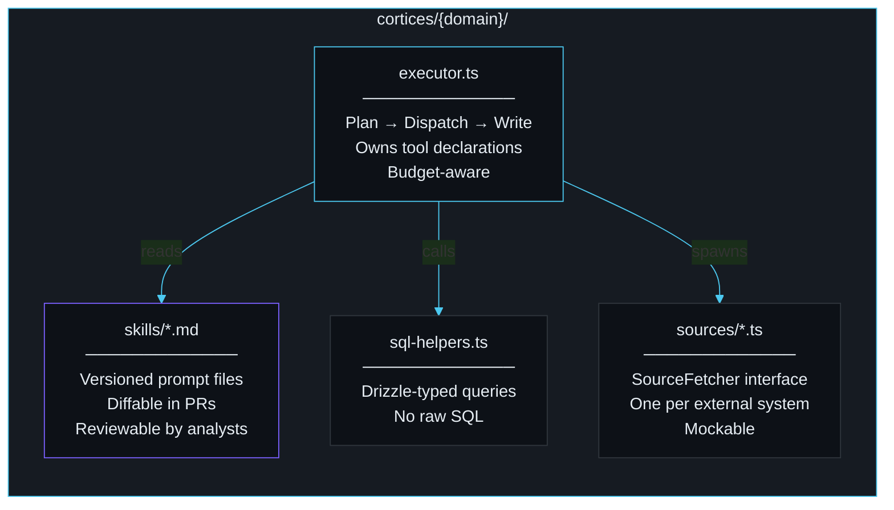

### Explorer — nano swarm economics

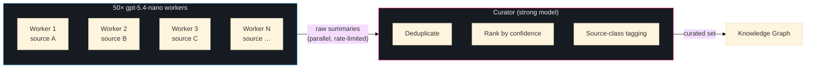

**Why this beats a single strong model:** ~10× cheaper per source. Bounded latency (parallel, not sequential). Each worker is individually cappable. Failure of one worker doesn't block the run. The strong model is reserved for the high-judgment task: ranking and deduplication.

---

## Sweep — DB audit + reviewer loop

### State machine

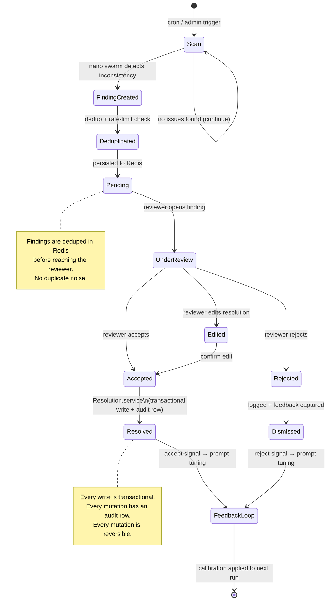

### Resolution guarantees

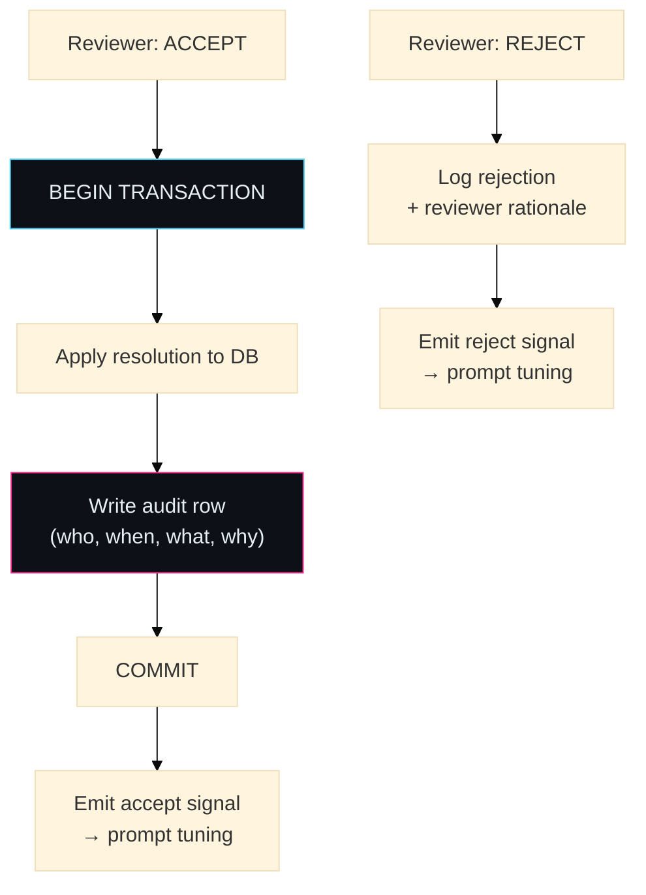

---

## Primary build — Space Situational Awareness

### Dual-stream fusion


### Confidence propagation — by construction

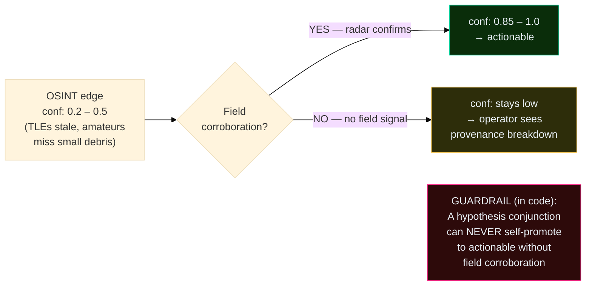

### Entity model

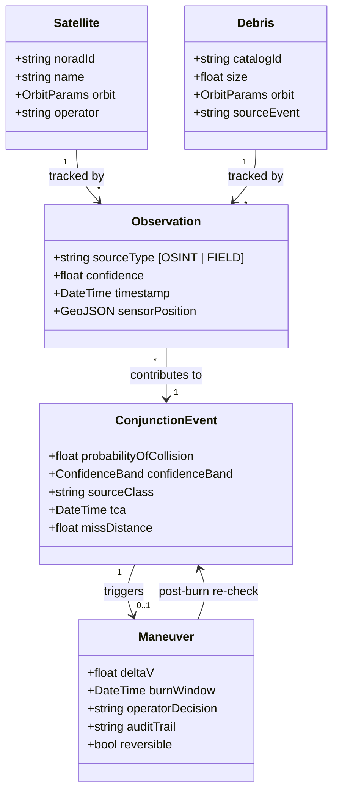

---

## One-step transposition — Threat Intelligence

Same orchestrator. Same cortex pattern. Same nano swarm. Same HITL sweep. Same guardrails. The transposition is a schema rename + a new fetcher bundle.

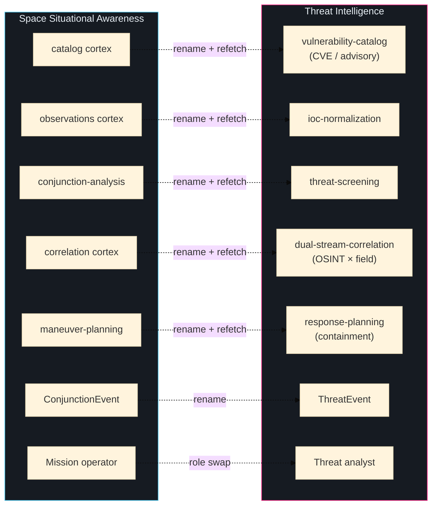

**What changes per transposition:**

| Layer               | Changed            | Unchanged |
| ------------------- | ------------------ | --------- |
| Schema (entities)   | ✅ rename          | —         |
| Skill prompts (.md) | ✅ domain-specific | —         |
| Source fetchers     | ✅ new bundle      | —         |
| Orchestrator        | —                  | ✅        |
| Cortex pattern      | —                  | ✅        |
| Nano swarm          | —                  | ✅        |
| HITL loop           | —                  | ✅        |
| Guardrails          | —                  | ✅        |
| Confidence model    | —                  | ✅        |
| Audit trail         | —                  | ✅        |

### Other transpositions (available on request)

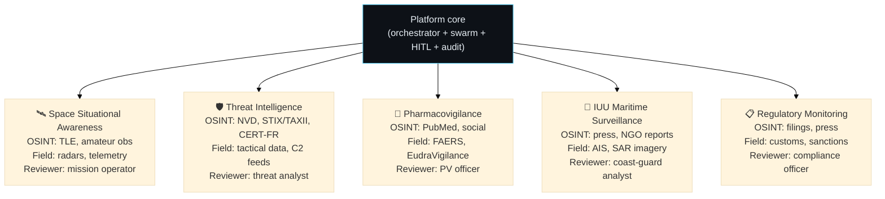

---

## Shared foundation

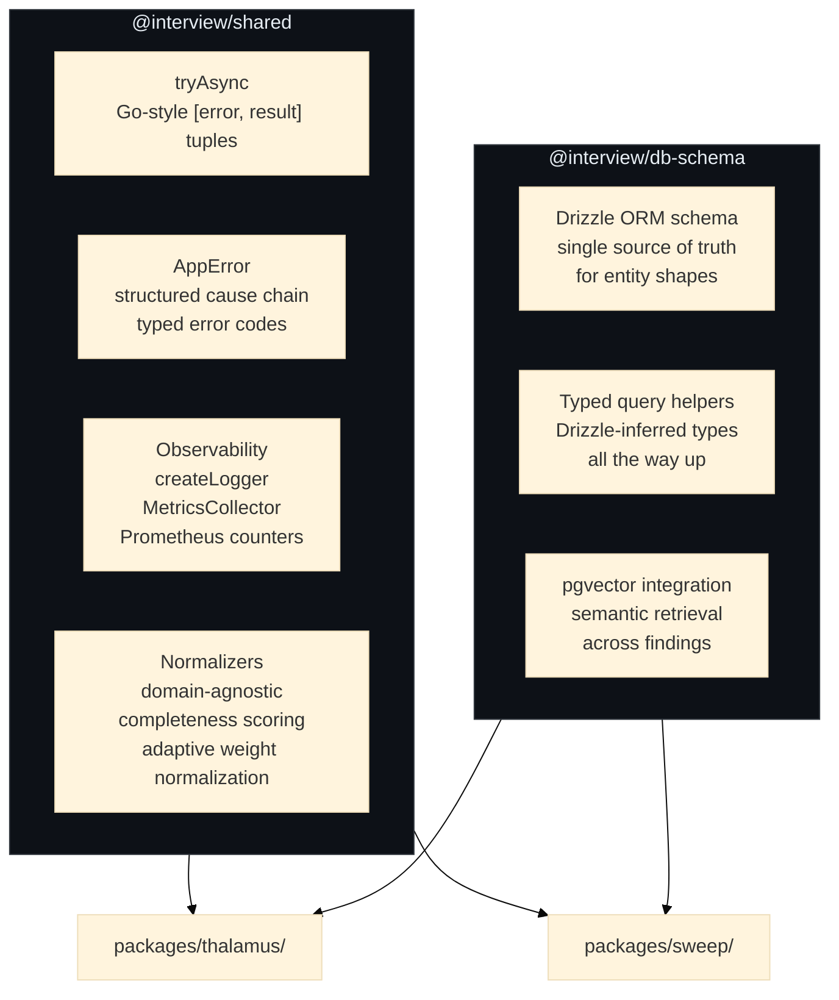

### 5-layer architecture (per feature package)

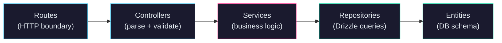

**Invariants:** no business logic in controllers or repositories. No `any`/`unknown` in repo signatures. Drizzle-inferred types end-to-end. Zod validation at the LLM I/O boundary.

---

## Design choices worth discussing

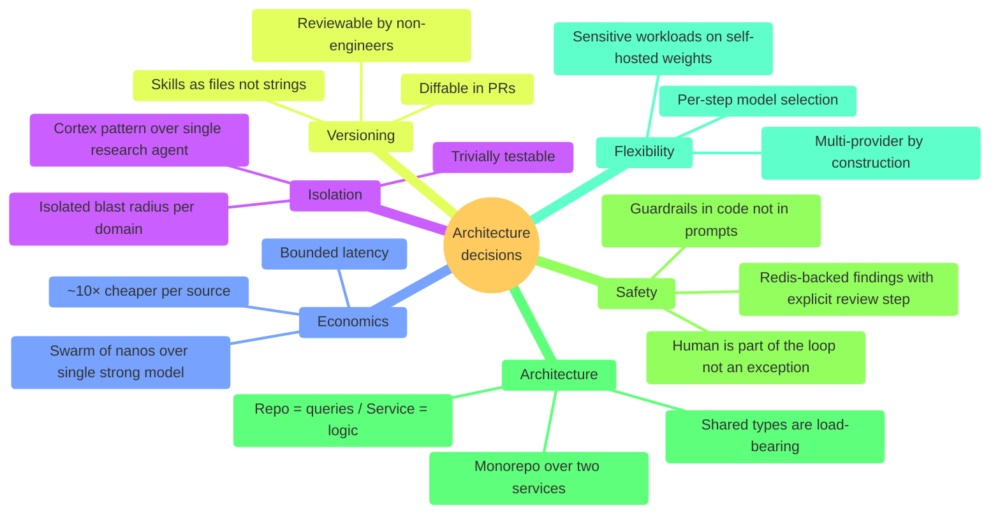

---

## Running locally

```bash
pnpm install
pnpm -r typecheck   # all packages
pnpm test           # vitest workspace (unit / integration / e2e)

make console        # Palantir-style operator UI on :5173 (+ console-api :4000)
```

External dependencies: Redis + Postgres for the backend services. The operator console (`apps/console/`) runs standalone against fixtures, no DB required.

## Operator console — `apps/console/`

Vite + React + TypeScript · three modes on a shared Palantir-calibrated shell:

- **OPS** — wireframe globe (react-three-fiber + drei) with satellites propagated from Keplerian elements and conjunction arcs colored by Pc band. Click a satellite → drawer with orbital elements and active conjunctions.
- **THALAMUS** — Knowledge Graph (sigma.js + ForceAtlas2 via webworker). Nodes by entity class (Satellite / Operator / Payload / OrbitRegime / ConjunctionEvent / Maneuver), edges colored by provenance (OSINT / Field / derived), widths weighted by confidence.
- **SWEEP** — dense findings graph with `Overview | Map | Stats` tabs. Nodes colored by decision status (pending / accepted / rejected / in-review), edges by co-citation. Accept / reject / review with reason, optimistic update, audit written.

Design system locked in [design-system/MASTER.md](design-system/MASTER.md); per-mode overrides in [design-system/pages/](design-system/pages/). Palette, typography, spacing, anti-patterns calibrated to Palantir Gotham — not a SaaS product.

Fixtures in [apps/console-api/src/fixtures.ts](apps/console-api/src/fixtures.ts) seed 600 satellites, 180 conjunctions, 226 KG nodes, 420 edges, 1200 findings deterministically — demo boots without Postgres. Swap the fixture module for real Drizzle queries when wiring to production data.

## What's been trimmed

Frontend, ingestion pipelines, voice agent, multi-tenant/billing — removed to keep the read on the design. Proprietary data, client identifiers, production secrets: sanitized. The public code is the architecture.

## References

| Author(s)            | Work                                                         | Year      |
| -------------------- | ------------------------------------------------------------ | --------- |
| Karpathy, A.         | _Software 2.0_                                               | 2017      |
| Karpathy, A.         | _Intro to Large Language Models_; nanoGPT                    | 2022–2023 |
| Shazeer et al.       | _Outrageously Large Neural Networks: Sparsely-Gated MoE_     | 2017      |
| Fedus, Zoph, Shazeer | _Switch Transformer_                                         | 2021      |
| Yao et al.           | _ReAct: Synergizing Reasoning and Acting in LMs_             | 2022      |
| Park et al.          | _Generative Agents: Interactive Simulacra of Human Behavior_ | 2023      |
| Christiano et al.    | _Deep RL from Human Preferences_                             | 2017      |
| Ouyang et al.        | _InstructGPT_                                                | 2022      |
| Huyen, C.            | _Designing Machine Learning Systems_ (O'Reilly)              | 2022      |
| Willison, S.         | LLM tool use, prompt injection, typed boundaries             | 2023–     |

## See also

- [TODO.md](TODO.md) — extraction state + planned test coverage
- [CHANGELOG.md](CHANGELOG.md) — extraction history
- [packages/thalamus/src/cortices/skills/](packages/thalamus/src/cortices/skills/) — skill prompts as markdown
- [docs/specs/thalamus/dual-stream-confidence.tex](docs/specs/thalamus/dual-stream-confidence.tex) — SPEC-TH-040
- [docs/specs/thalamus/field-correlation.tex](docs/specs/thalamus/field-correlation.tex) — SPEC-TH-041

Redis and Postgres are the two external dependencies. Everything else is stubbed for review.

## What's been trimmed

To keep the read focused, the original frontend, ingestion pipelines, voice agent, and multi-tenant/billing concerns have been removed. Proprietary data, client identifiers, and production secrets are sanitized. The public code is the design.

## See also

- [TODO.md](TODO.md) — extraction state + planned strategic test coverage
- [CHANGELOG.md](CHANGELOG.md) — extraction history
- [packages/thalamus/src/cortices/skills/](packages/thalamus/src/cortices/skills/) — skill prompts, readable as markdown
