# Thalamus & Sweep — Agentic Systems Portfolio

> **Two production agentic backends. One shared typed foundation.**
> Thalamus creates knowledge. Sweep maintains it. Together they close the loop.

Two production agentic backends I designed and shipped, extracted and trimmed so the design can be read end-to-end:

- **Thalamus** — multi-cortex research agent. Decomposes an open question into specialized cortices, plans tool calls, explores sources in parallel via a nano-model swarm, synthesizes, and writes structured findings to a knowledge graph.
- **Sweep** — continuous knowledge-base auditor with human-in-the-loop. A nano-model swarm scans the DB for inconsistencies, drafts resolutions, surfaces them to a reviewer UI, and uses accept/reject signals to tune the next run.

Producer / maintainer halves of the same knowledge loop: Thalamus creates, Sweep maintains.

> The architecture is domain-agnostic. Illustrated on a critical-system use case — orbital collision avoidance, where a false negative ends in a Kessler cascade and a false positive burns a satellite's delta-v budget — then transposed to threat intelligence, pharmacovigilance and maritime surveillance with the same orchestrator, swarm, and HITL loop.

---

## System topology

The two subsystems share a typed foundation and form a closed knowledge loop: Thalamus writes to the knowledge graph, Sweep audits it, human decisions refine both.

```mermaid
%%{init: {'theme':'base','themeVariables':{'background':'#0b0f17','primaryColor':'#11182a','primaryTextColor':'#e6edf3','primaryBorderColor':'#4cc9f0','secondaryColor':'#1a2033','tertiaryColor':'#141a28','secondaryTextColor':'#e6edf3','tertiaryTextColor':'#e6edf3','noteTextColor':'#e6edf3','noteBkgColor':'#1a2033','noteBorderColor':'#4cc9f0','lineColor':'#7dd3fc','textColor':'#e6edf3','mainBkg':'#11182a','secondBkg':'#1a2033','clusterBkg':'#0d1320','clusterBorder':'#4cc9f0','titleColor':'#e6edf3','edgeLabelBackground':'#0b0f17','labelBoxBkgColor':'#11182a','labelBoxBorderColor':'#4cc9f0','labelTextColor':'#e6edf3','actorBkg':'#11182a','actorBorder':'#4cc9f0','actorTextColor':'#e6edf3','actorLineColor':'#7dd3fc','signalColor':'#e6edf3','signalTextColor':'#e6edf3','activationBkgColor':'#1a2033','activationBorderColor':'#4cc9f0','sequenceNumberColor':'#0b0f17','classText':'#e6edf3'}}}%%
flowchart TB
    classDef default fill:#11182a,stroke:#4cc9f0,stroke-width:1px,color:#e6edf3;
    subgraph FOUNDATION["@interview/shared + @interview/db-schema"]
        direction LR
        tryAsync["tryAsync<br/>(Go-style error tuples)"]
        AppError["AppError hierarchy<br/>(structured causes)"]
        Observability["Observability<br/>(logger, metrics, traces)"]
        Drizzle["Drizzle ORM<br/>(typed schema + repos)"]
        Zod["Zod validation<br/>(LLM I/O boundary)"]
    end

    subgraph THALAMUS["Thalamus — Research Agent"]
        direction TB
        Orch["Orchestrator"]
        Registry["Cortex Registry"]
        Cortices["Cortices<br/>(domain-specialized)"]
        Explorer["Explorer<br/>(nano swarm ×50)"]
        Curator["Curator<br/>(strong model)"]
        KG["Knowledge Graph<br/>(Postgres + pgvector)"]

        Orch -->|"select by query shape"| Registry
        Registry -->|"dispatch"| Cortices
        Cortices -->|"plan tools + spawn"| Explorer
        Explorer -->|"raw summaries"| Curator
        Curator -->|"ranked findings"| KG
    end

    subgraph SWEEP["Sweep — Auditor + HITL"]
        direction TB
        Cron["Cron / Admin trigger"]
        NanoSweep["NanoSweep service<br/>(nano swarm)"]
        Redis["Redis<br/>(pending findings)"]
        ReviewerUI["Reviewer UI"]
        Resolution["Resolution service<br/>(transactional writes)"]
        Feedback["Feedback loop<br/>(prompt tuning)"]

        Cron --> NanoSweep
        NanoSweep -->|"deduped findings"| Redis
        Redis --> ReviewerUI
        ReviewerUI -->|"accept / reject / edit"| Resolution
        Resolution -->|"audit row + DB write"| Feedback
    end

    THALAMUS -->|"writes entities"| KG
    KG -.->|"audited by"| SWEEP
    Feedback -.->|"calibrates next run"| NanoSweep
    FOUNDATION --- THALAMUS
    FOUNDATION --- SWEEP

    style FOUNDATION fill:#0d1117,stroke:#30363d,color:#e6edf3
    style THALAMUS fill:#161b22,stroke:#4cc9f0,color:#e6edf3
    style SWEEP fill:#161b22,stroke:#f72585,color:#e6edf3
```



---

## What's inside

Deep dives live as LaTeX specs in [`docs/specs/architecture/`](docs/specs/architecture/) — same convention as the existing module specs (`docs/specs/thalamus/`, `docs/specs/sweep/`…). Each one compiles to a standalone PDF; source `.tex` + pre-rendered PDF are both in the repo. Read in this order for the full narrative, or jump to the part you need:

|   # | Spec                                                                    | What's there                                                                       |
| --: | ----------------------------------------------------------------------- | ---------------------------------------------------------------------------------- |
|  01 | [Ontology](docs/specs/architecture/01-ontology.pdf)                     | Shared vocabulary — cortex, skill, nano, swarm, fish, curator, sweep, finding…     |
|  02 | [Design stance](docs/specs/architecture/02-design-stance.pdf)           | Positions taken + LLM-as-Kernel analogy + lineage of references                    |
|  03 | [Layout](docs/specs/architecture/03-layout.pdf)                         | `apps/` + `packages/` arborescence and the 5-layer backend convention              |
|  04 | [Thalamus](docs/specs/architecture/04-thalamus.pdf)                     | Orchestration sequence, cortex anatomy, explorer/swarm, reflexion loop             |
|  05 | [Sweep](docs/specs/architecture/05-sweep.pdf)                           | State machine, resolution guarantees, what the swarm looks for                     |
|  06 | [Primary build — SSA](docs/specs/architecture/06-ssa-primary-build.pdf) | Dual-stream fusion, confidence propagation, cortices, entity model                 |
|  07 | [Transpositions](docs/specs/architecture/07-transpositions.pdf)         | Threat intel, pharmacovigilance, IUU maritime, regulatory — same loop, swap schema |
|  08 | [Three swarms](docs/specs/architecture/08-three-swarms.pdf)             | Retrieval / audit / counterfactual — the three flavours of the swarm primitive     |
|  09 | [Shared foundation](docs/specs/architecture/09-shared-foundation.pdf)   | `@interview/shared` + `db-schema` + 5-layer architecture per package               |
|  10 | [Design choices](docs/specs/architecture/10-design-choices.pdf)         | Mindmap + 8 architectural decisions with rationale                                 |
|  11 | [Running locally](docs/specs/architecture/11-running-locally.pdf)       | `pnpm`, `make`, `THALAMUS_MODE=record/fixtures`, full end-to-end SSA pipeline      |
|  12 | [Consoles](docs/specs/architecture/12-consoles.pdf)                     | SSA CLI (Ink REPL) + Operator console (R3F + sigma.js)                             |
|  13 | [References](docs/specs/architecture/13-references.pdf)                 | Bibliography (Karpathy, Shazeer, Yao, Christiano, Willison…)                       |

Rebuild everything: `make -C docs/specs all` (requires `latexmk` + `pdflatex`; mermaid diagrams rebuild from `.mmd` via `mmdc` installed as a dev-dependency).

---

## Quickstart

```bash
pnpm install
pnpm -r typecheck   # all packages
pnpm test:policy    # structural test contract (no todo/skip/vague placeholders)
pnpm test           # vitest workspace (unit / integration / e2e)

make console        # Palantir-style operator UI on :5173 (+ console-api :4000)
```

The operator console runs standalone against fixtures — no DB required. For the full end-to-end SSA pipeline (Postgres + Redis + live LLMs or fixture replay), see [SPEC-ARCH-11](docs/specs/architecture/11-running-locally.pdf).

---

## What's been trimmed

Frontend beyond the console, ingestion pipelines, voice agent, multi-tenant / billing concerns — removed to keep the read focused on the design. Proprietary data, client identifiers, production secrets: sanitized. The public code is the architecture.

---

## See also

- [TODO.md](TODO.md) — extraction state + planned test coverage
- [CHANGELOG.md](CHANGELOG.md) — extraction history
- [docs/testing/README.md](docs/testing/README.md) — repo testability strategy + CI contract
- [apps/console-api/src/agent/ssa/skills/](apps/console-api/src/agent/ssa/skills/) — SSA skill prompts as markdown
- [docs/specs/thalamus/dual-stream-confidence.tex](docs/specs/thalamus/dual-stream-confidence.tex) — SPEC-TH-040
- [docs/specs/thalamus/field-correlation.tex](docs/specs/thalamus/field-correlation.tex) — SPEC-TH-041
