# Thalamus & Sweep — Agentic Systems Portfolio

> **Two production agentic backends. One shared typed foundation.**
> Thalamus creates knowledge. Sweep maintains it. Together they close the loop.

Two production agentic backends I designed and shipped, extracted and trimmed so the design can be read end-to-end:

- **Thalamus** — multi-cortex research agent. Decomposes an open question into specialized cortices, plans tool calls, explores sources in parallel via a nano-model swarm, synthesizes, and writes structured findings to a knowledge graph.
- **Sweep** — continuous knowledge-base auditor with human-in-the-loop. A nano-model swarm scans the DB for inconsistencies, drafts resolutions, surfaces them to a reviewer UI, and uses accept/reject signals to tune the next run.

Producer / maintainer halves of the same knowledge loop: Thalamus creates, Sweep maintains.

> The architecture is domain-agnostic. Illustrated below on a critical-system use case — orbital collision avoidance, where a false negative ends in a Kessler cascade and a false positive burns a satellite's delta-v budget — then transposed to threat intelligence, pharmacovigilance and maritime surveillance with the same orchestrator, swarm, and HITL loop.

---

## Ontology

<!-- Explicit vocabulary for both human readers and LLM consumers. Every term below is used consistently throughout the document. -->

| Term               | Definition                                                                                                                                                                                                    |
| ------------------ | ------------------------------------------------------------------------------------------------------------------------------------------------------------------------------------------------------------- |
| **Cortex**         | A domain-specialized execution unit. Owns its tools, skill prompts, SQL helpers, and cost budget. Isolated blast radius.                                                                                      |
| **Skill**          | A markdown prompt file, versioned with the code. The "binary" the cortex runs.                                                                                                                                |
| **Nano worker**    | A cheap, fast model instance (e.g. `gpt-5.4-nano`) doing bounded retrieval or classification in a swarm.                                                                                                      |
| **Swarm**          | Execution _primitive_: fan-out of K parallel bounded workers + a curator / aggregator collapse. The repo has _three flavours_ (retrieval, audit, counterfactual) — see _Three swarms_ below. Not a subsystem. |
| **Fish**           | One instance inside a counterfactual (sim) swarm — one `sim_run` playing a perturbed variant of a scenario for N turns. The swarm is the school; each fish swims its own perturbation.                        |
| **Curator**        | A stronger model (or pure aggregator) that deduplicates, ranks, and synthesizes worker / fish outputs into a single ranked payload.                                                                           |
| **Sweep**          | _Subsystem_: continuous DB audit + HITL loop (scan → finding → Redis → reviewer → resolution → audit → feedback). Uses swarms as a primitive. Not to be confused with the swarm itself.                       |
| **Finding**        | A structured observation (inconsistency, threat, conjunction) surfaced by the swarm, pending human review.                                                                                                    |
| **Resolution**     | A transactional DB write triggered by an accepted finding. Always audited, always reversible.                                                                                                                 |
| **HITL**           | Human-in-the-loop. The reviewer is a first-class system component, not an exception path.                                                                                                                     |
| **Dual-stream**    | OSINT (low-confidence, high-volume) fused with Field (high-confidence, restricted). Confidence is never self-promoted.                                                                                        |
| **Source fetcher** | A typed adapter behind the `SourceFetcher` interface. One per external system. Swappable, mockable.                                                                                                           |

---

## System topology

The two subsystems share a typed foundation and form a closed knowledge loop: Thalamus writes to the knowledge graph, Sweep audits it, human decisions refine both.

```mermaid
%%{init: {'theme':'base','themeVariables':{'background':'#0b0f17','primaryColor':'#11182a','primaryTextColor':'#e6edf3','primaryBorderColor':'#4cc9f0','secondaryColor':'#1a2033','tertiaryColor':'#141a28','secondaryTextColor':'#e6edf3','tertiaryTextColor':'#e6edf3','noteTextColor':'#e6edf3','noteBkgColor':'#1a2033','noteBorderColor':'#4cc9f0','lineColor':'#7dd3fc','textColor':'#e6edf3','mainBkg':'#11182a','secondBkg':'#1a2033','clusterBkg':'#0d1320','clusterBorder':'#4cc9f0','titleColor':'#e6edf3','edgeLabelBackground':'#0b0f17','labelBoxBkgColor':'#11182a','labelBoxBorderColor':'#4cc9f0','labelTextColor':'#e6edf3','actorBkg':'#11182a','actorBorder':'#4cc9f0','actorTextColor':'#e6edf3','actorLineColor':'#7dd3fc','signalColor':'#e6edf3','signalTextColor':'#e6edf3','activationBkgColor':'#1a2033','activationBorderColor':'#4cc9f0','sequenceNumberColor':'#0b0f17','classText':'#e6edf3'}}}%%
flowchart TB
    classDef default fill:#11182a,stroke:#4cc9f0,stroke-width:1px,color:#e6edf3;
    subgraph FOUNDATION["@interview/shared + @interview/db-schema"]
        direction LR
        tryAsync["tryAsync<br/>(Go-style error tuples)"]
        AppError["AppError hierarchy<br/>(structured causes)"]
        Observability["Observability<br/>(logger, metrics, traces)"]
        Drizzle["Drizzle ORM<br/>(typed schema + repos)"]
        Zod["Zod validation<br/>(LLM I/O boundary)"]
    end

    subgraph THALAMUS["Thalamus — Research Agent"]
        direction TB
        Orch["Orchestrator"]
        Registry["Cortex Registry"]
        Cortices["Cortices<br/>(domain-specialized)"]
        Explorer["Explorer<br/>(nano swarm ×50)"]
        Curator["Curator<br/>(strong model)"]
        KG["Knowledge Graph<br/>(Postgres + pgvector)"]

        Orch -->|"select by query shape"| Registry
        Registry -->|"dispatch"| Cortices
        Cortices -->|"plan tools + spawn"| Explorer
        Explorer -->|"raw summaries"| Curator
        Curator -->|"ranked findings"| KG
    end

    subgraph SWEEP["Sweep — Auditor + HITL"]
        direction TB
        Cron["Cron / Admin trigger"]
        NanoSweep["NanoSweep service<br/>(nano swarm)"]
        Redis["Redis<br/>(pending findings)"]
        ReviewerUI["Reviewer UI"]
        Resolution["Resolution service<br/>(transactional writes)"]
        Feedback["Feedback loop<br/>(prompt tuning)"]

        Cron --> NanoSweep
        NanoSweep -->|"deduped findings"| Redis
        Redis --> ReviewerUI
        ReviewerUI -->|"accept / reject / edit"| Resolution
        Resolution -->|"audit row + DB write"| Feedback
    end

    THALAMUS -->|"writes entities"| KG
    KG -.->|"audited by"| SWEEP
    Feedback -.->|"calibrates next run"| NanoSweep
    FOUNDATION --- THALAMUS
    FOUNDATION --- SWEEP

    style FOUNDATION fill:#0d1117,stroke:#30363d,color:#e6edf3
    style THALAMUS fill:#161b22,stroke:#4cc9f0,color:#e6edf3
    style SWEEP fill:#161b22,stroke:#f72585,color:#e6edf3
```

---

## Design stance

The shape of the problem matters more than the domain. A few positions this repo takes:

- **The LLM as a kernel, not an application.** The orchestrator is the OS; cortices are processes; tools are syscalls; prompts are binaries on disk. The recursive research loop in Thalamus is closer to the autoresearch pattern that inspired this repo; the kernel analogy is the engineering metaphor used to explain how the pieces are wired.
- **Swarms of small models beat one big one for retrieval.** Up to 50 nano workers crawl and summarize in parallel; a stronger curator dedupes and ranks. Orders of magnitude cheaper than a single strong model per source, bounded latency, easier to cap.
- **Bounded agents, not free-form ones.** Every cortex declares its skills, tools, cost budget and depth cap. Guardrails live in the orchestrator, in code, not in prompts.
- **Deterministic layer beneath the LLMs.** Drizzle ORM, typed repositories, transactional resolutions, structured findings. The model drafts; the system commits. No ad-hoc SQL from the agent.
- **Human-in-the-loop as a first-class citizen.** Sweep is designed around a reviewer, not around autonomy. Accept/reject signals on findings feed back into the next swarm run's prompt per category. Poor-man's RLHF — calibration without a training run.
- **Observability from day one.** Structured logs, Prometheus counters, per-step traces. Cost and latency instrumented per cortex, per source, per skill.
- **Skills as files, not strings.** Each skill is a markdown prompt versioned with the code. Diffable in PRs, reviewable by non-engineers.
- **Testability end-to-end.** 5-layer architecture, Drizzle-typed repos, isolated services, vitest workspace with unit / integration / e2e.

```mermaid
%%{init: {'theme':'base','themeVariables':{'background':'#0b0f17','primaryColor':'#11182a','primaryTextColor':'#e6edf3','primaryBorderColor':'#4cc9f0','secondaryColor':'#1a2033','tertiaryColor':'#141a28','secondaryTextColor':'#e6edf3','tertiaryTextColor':'#e6edf3','noteTextColor':'#e6edf3','noteBkgColor':'#1a2033','noteBorderColor':'#4cc9f0','lineColor':'#7dd3fc','textColor':'#e6edf3','mainBkg':'#11182a','secondBkg':'#1a2033','clusterBkg':'#0d1320','clusterBorder':'#4cc9f0','titleColor':'#e6edf3','edgeLabelBackground':'#0b0f17','labelBoxBkgColor':'#11182a','labelBoxBorderColor':'#4cc9f0','labelTextColor':'#e6edf3','actorBkg':'#11182a','actorBorder':'#4cc9f0','actorTextColor':'#e6edf3','actorLineColor':'#7dd3fc','signalColor':'#e6edf3','signalTextColor':'#e6edf3','activationBkgColor':'#1a2033','activationBorderColor':'#4cc9f0','sequenceNumberColor':'#0b0f17','classText':'#e6edf3'}}}%%
flowchart LR
    classDef default fill:#11182a,stroke:#4cc9f0,stroke-width:1px,color:#e6edf3;
    subgraph ANALOGY["LLM-as-Kernel analogy"]
        direction TB
        OS["Orchestrator = OS"]
        Proc["Cortex = Process"]
        Sys["Tool = Syscall"]
        Bin["Skill prompt = Binary on disk"]
        Mem["Knowledge graph = Filesystem"]
        Guard["Guardrails = Kernel enforced limits"]
    end

    subgraph PRINCIPLES["Non-negotiable constraints"]
        direction TB
        P1["Guardrails live in CODE,<br/>never in prompts"]
        P2["LLM output = untrusted input<br/>(Willison principle)"]
        P3["Human reviewer = first-class<br/>system component"]
        P4["No ad-hoc SQL from agents.<br/>Drizzle-typed repos only."]
        P5["Every mutation audited,<br/>every mutation reversible"]
    end

    ANALOGY --- PRINCIPLES
```

**Positions and lineage:**

| Position                                        | Source                                                                                                |
| ----------------------------------------------- | ----------------------------------------------------------------------------------------------------- |
| LLM as scheduled kernel component               | Internal engineering metaphor; recursive research loop inspired by Karpathy's autoresearch pattern    |
| Swarm of nanos > one strong model for retrieval | Adjacent to the nanoGPT thread; Shazeer et al. _MoE_ (2017); Fedus et al. _Switch Transformer_ (2021) |
| Bounded agents, not free-form                   | Park et al. _Generative Agents_ (2023); Yao et al. _ReAct_ (2022)                                     |
| Deterministic layer beneath LLMs                | Willison — LLMs as untrusted input generators, typed boundaries                                       |
| HITL as first-class citizen                     | Christiano et al. _Deep RL from Human Preferences_ (2017); Ouyang et al. _InstructGPT_ (2022)         |
| Observability from day one                      | Huyen, _Designing ML Systems_ (2022)                                                                  |
| Skills as files, not strings                    | _Software 2.0_ corollary — prompts are source, treat them as such                                     |

---

## Layout

```
apps/
  console/      Operator UI (React + r3f + sigma.js) — OPS / THALAMUS / SWEEP modes
  console-api/  Fastify API, SSA domain pack (skills, domain-config, cortex-data-provider)
packages/
  shared/       Cross-cutting: tryAsync, AppError, enums, observability, normalizers
  db-schema/    Drizzle ORM schema + typed query helpers (one source of truth)
  thalamus/     Research agent: cortices, orchestrator, explorer/swarm, planner
  sweep/        Auditor: nano-swarm, resolution service, admin routes, BullMQ jobs
  cli/          Conversational SSA console (Ink REPL)
```

Conventional 5-layer backend inside each feature package: `routes → controllers → services → repositories → entities`. No business logic in controllers or repositories. No `any`/`unknown` in repo signatures — Drizzle-inferred types all the way up. SSA skills and domain config live in `apps/console-api/src/agent/ssa/` so the Thalamus kernel stays domain-agnostic.

---

## Thalamus — multi-cortex research agent

Entry point: [packages/thalamus/src/orchestrators/executor.ts](packages/thalamus/src/orchestrators/executor.ts)

### Orchestration sequence

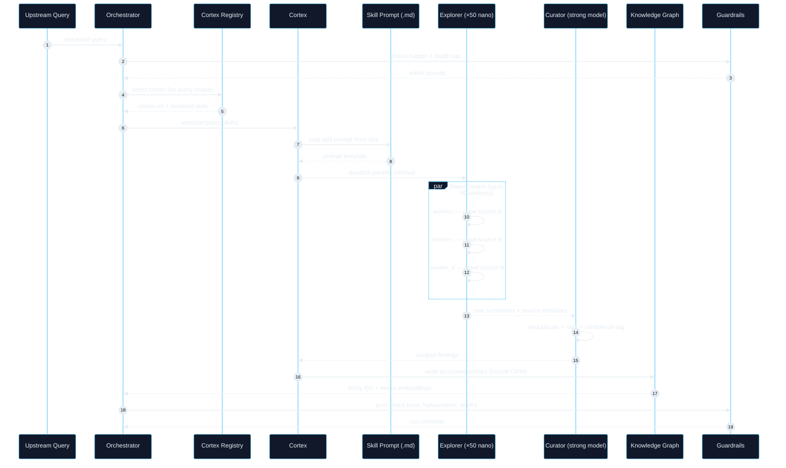

### Cortex anatomy

Each cortex is a self-contained folder. Adding a capability means adding a folder, not editing a god-function.

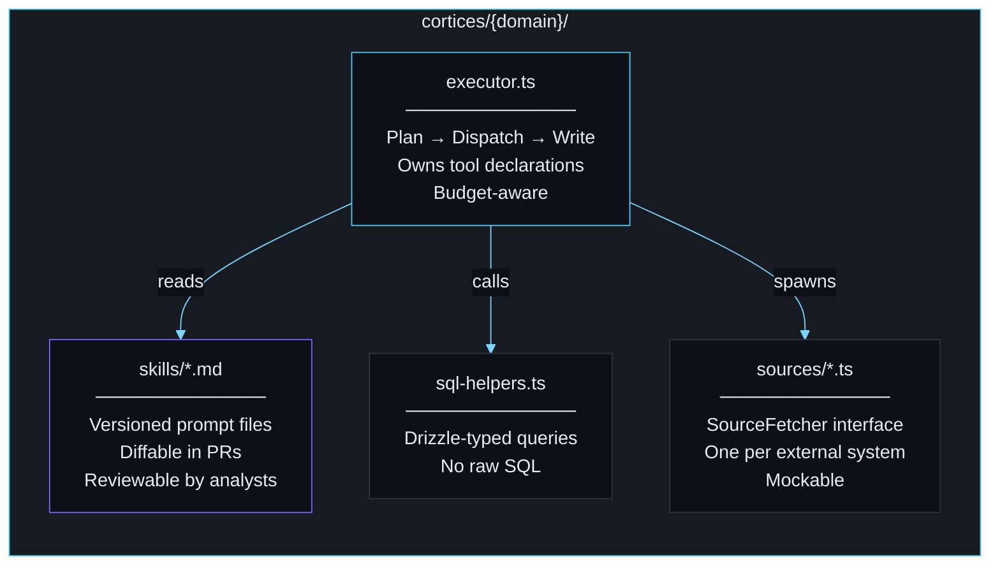

### Explorer — nano swarm economics


**Why this beats a single strong model:** ~10× cheaper per source. Bounded latency (parallel, not sequential). Each worker is individually cappable. Failure of one worker doesn't block the run. The strong model is reserved for the high-judgment task: ranking and deduplication.

### Reflexion loop

After each iteration the system self-evaluates. Eagerness checks complexity, average confidence, coverage ratio and novelty; a gap list feeds back into the planner for the next round. A circuit-breaker (two identical gap rounds → force-stop) prevents runaway loops. Knowledge graph writes land in Postgres (Drizzle + pgvector — HNSW `halfvec_cosine_ops` at 2048 dims) through typed repositories, never ad-hoc SQL from the agent.

---

## Sweep — DB audit + reviewer loop

Entry point: [packages/sweep/src/services/nano-sweep.service.ts](packages/sweep/src/services/nano-sweep.service.ts)

### State machine

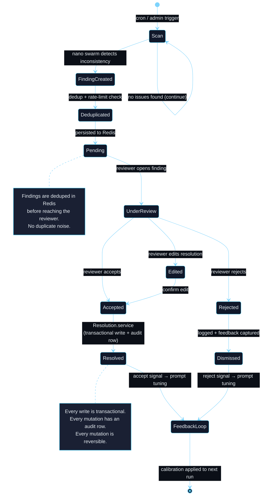

### Resolution guarantees

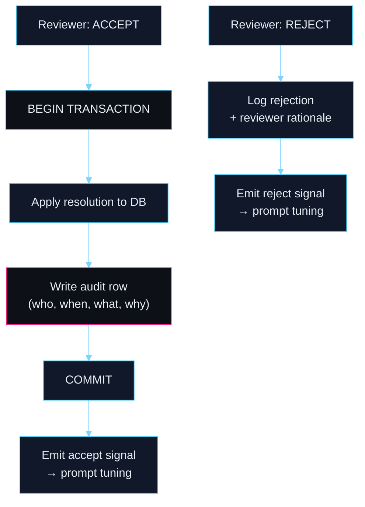

### What the swarm looks for

- **Inconsistencies** — missing fields, suspect classifications, stale entries. Scanned in parallel, rate-limited, budgeted.
- **Catalog enrichment** (April 2026) — two fill paths emitting navigable findings in the knowledge graph:
  - _Web mission_ (nano + `web_search`) — structured-outputs JSON schema, hedging-token blocklist, source-URL validation, per-column range guards, unit-mismatch check, 2-vote corroboration. Per-satellite granularity, payload-only filter.
  - _KNN propagation_ (zero-LLM) — for each payload missing a field, finds K nearest embedded neighbours (Voyage halfvec cosine) with the field set and propagates their consensus value. ±10% agreement on numeric, ⅔ mode coverage on text.
  - Every fill emits a `research_finding` (`cortex=data_auditor`, `finding_type=insight`) with `research_edge`s — `about` → target, `similar_to` → neighbours / cited URL.
- **Orbital reflexion pass** — second-pass anomaly detector that cross-tabulates a suspect satellite's orbital fingerprint (inclination, RAAN, mean motion) against the declared classification. Surfaces military-lineage peers (Yaogan, Cosmos, NROL, Shiyan…) sharing the same inclination belt. Emits `anomaly` findings with navigable provenance. Pure SQL, no LLM.
- **Editorial copilot** — same pipeline drafts structured briefings from audited data.
- **Autonomy loop** — `POST /api/autonomy/start` rotates Thalamus cycles (6 rotating SSA queries) with Sweep null-scans; topbar pill + FEED panel stream each tick live in the console.

---

## Primary build — Space Situational Awareness

Collision avoidance in orbit is the archetypal dual-stream critical-system loop. Noisy open catalogs and amateur observations vs. high-trust classified radars. An operator in the loop before any maneuver. Confidence thresholds that trigger money (delta-v) and avoid Kessler cascades.

### Dual-stream fusion

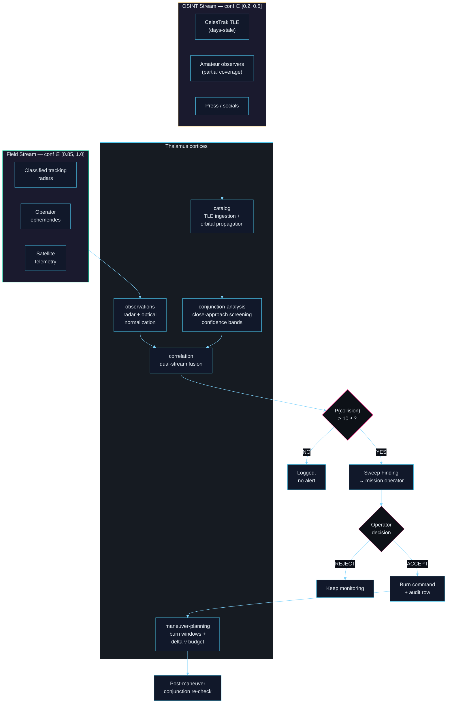

### Confidence propagation — by construction

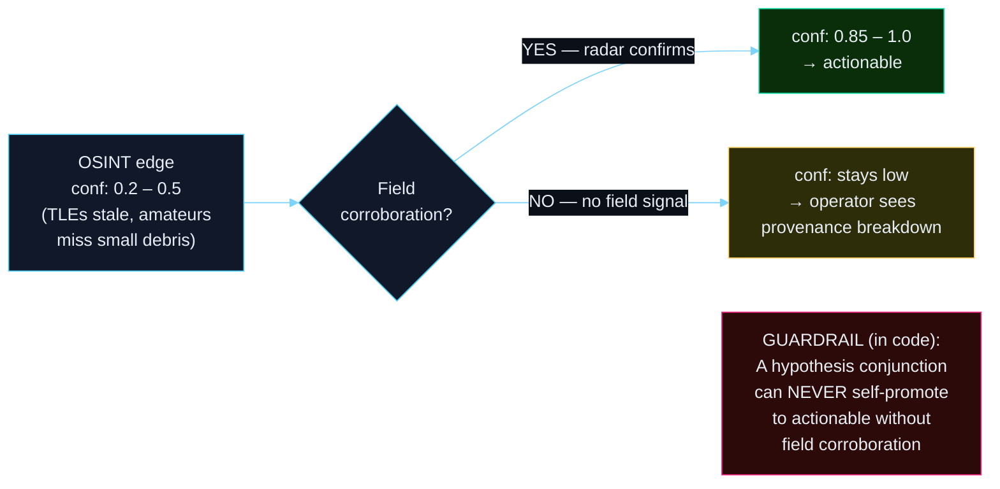

This is exactly the shape defined in [SPEC-TH-040 `dual-stream-confidence`](docs/specs/thalamus/dual-stream-confidence.tex) and [SPEC-TH-041 `field-correlation`](docs/specs/thalamus/field-correlation.tex) — the specs were written to fit this use case.

### Cortices

- `catalog` — TLE / ephemeris ingestion, orbital propagation
- `observations` — radar + optical tracking data normalization
- `conjunction-analysis` — close-approach screening with confidence bands
- `correlation` — dual-stream fusion (public catalog × classified radar tracks)
- `maneuver-planning` — burn windows, delta-v budget, post-maneuver conjunction re-check

### Entity model

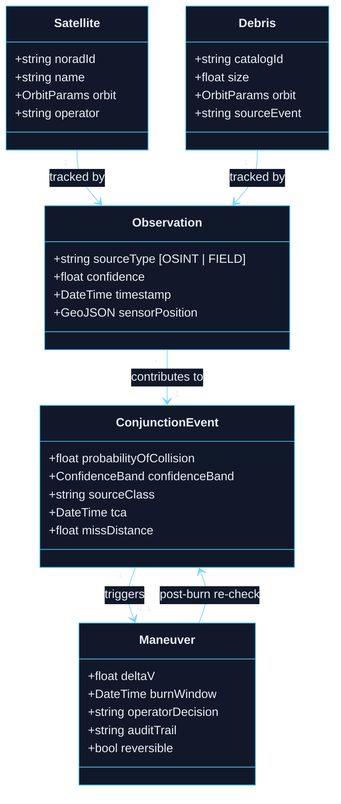

**HITL = mission operator.** Every `ConjunctionEvent` above threshold (P ≥ 10⁻⁴, standard NASA convention) becomes a Sweep finding. The operator validates or rejects before any burn is committed. Audit row per decision — the `Maneuver` ledger is reversible-by-design (a burn can be reconstructed from the audit trail post-incident).

**Why a platform, not a product:** any org running space assets — operators, agencies, earth-observation primes, secure-comms providers — has a variant of this loop. The platform industrializes it once (orchestrator, swarm, guardrails, HITL, audit); each tenant plugs its own catalog sources, radar feeds, and thresholds behind the same `SourceFetcher` interface.

---

## One-step transposition — Threat Intelligence

Same orchestrator. Same cortex pattern. Same nano swarm. Same HITL sweep. Same guardrails. The transposition is a schema rename + a new fetcher bundle.

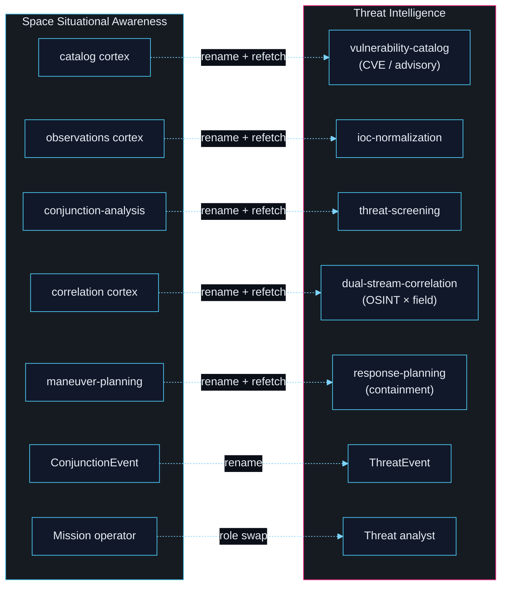

**What changes per transposition:**

| Layer               | Changed         | Unchanged |
| ------------------- | --------------- | --------- |
| Schema (entities)   | rename          | —         |
| Skill prompts (.md) | domain-specific | —         |
| Source fetchers     | new bundle      | —         |
| Orchestrator        | —               | kept      |
| Cortex pattern      | —               | kept      |
| Nano swarm          | —               | kept      |
| HITL loop           | —               | kept      |
| Guardrails          | —               | kept      |
| Confidence model    | —               | kept      |
| Audit trail         | —               | kept      |

### Other transpositions (available on request)

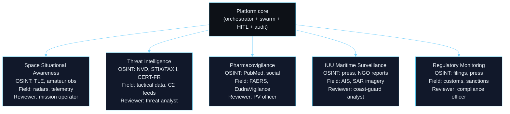

Each uses the same `docs/specs/` contracts. Each is a schema + skill-pack swap. None requires a new orchestrator, a new swarm, or a new HITL loop.

### What each domain actually does

Same architectural loop — _OSINT drafts, Field corroborates, human decides, system commits_ — applied to five different critical-system contexts. The substance of each column is what each stream carries, what the cortices compute, and what the reviewer is accountable for.

| Domain                  | OSINT stream brings…                                                                                                    | Field stream corroborates with…                                                                                | The cortices compute                                                                                                                                                                                       | Reviewer decides on                                                                                                                                                |
| ----------------------- | ----------------------------------------------------------------------------------------------------------------------- | -------------------------------------------------------------------------------------------------------------- | ---------------------------------------------------------------------------------------------------------------------------------------------------------------------------------------------------------- | ------------------------------------------------------------------------------------------------------------------------------------------------------------------ |
| **SSA**                 | CelesTrak / Space-Track TLEs (days-stale), amateur optical observers, launch-industry press, operator socials           | Classified phased-array radar tracks, operator-owned ephemerides, on-board telemetry                           | Orbital propagation (SGP4), close-approach screening with regime-conditioned covariance, Foster-1992 Pc on each pair                                                                                       | Whether to burn delta-v now, burn later, or keep monitoring — the `Maneuver` is audited and reversible from the ledger                                             |
| **Threat Intelligence** | NVD / CVE feeds, STIX-TAXII advisories, CERT-FR / ANSSI bulletins, MITRE ATT&CK updates, vendor blogs, underground chat | Tactical data-link traces, sensor-fusion bus, C2 telemetry, friendly-force tracking, mission debrief           | Exploitability × exposure scoring, IoC-to-asset fan-out, lateral-path projection, dwell-time anomaly                                                                                                       | Whether to contain, patch, or observe — every response action writes an audit row with the analyst's rationale                                                     |
| **Pharmacovigilance**   | PubMed abstracts, ClinicalTrials.gov entries, patient forums, pharmacist social posts, press releases                   | FAERS (FDA), EudraVigilance (EMA), VigiBase (WHO), prescriber-EHR signals routed through the sponsor's gateway | Disproportionality (PRR, ROR), temporal clustering per ATC code, severity-weighted signal detection                                                                                                        | Whether a signal crosses into a regulatory reporting obligation (EMA good practice — not negotiable, clock starts at receipt)                                      |
| **IUU maritime**        | Press, NGO reports (Global Fishing Watch, EJF), port-authority bulletins, crew testimony, fleet-owner socials           | AIS transponder tracks, Sentinel-1 SAR dark-vessel detection, coastal radar, VMS from flag-state authorities   | _Dark-vessel detection_: AIS gap ≥ N hours overlapping a SAR blob in an EEZ; transshipment pairing by rendezvous pattern; flag-hopping from registry diffs; gear-type inference from speed/heading profile | Whether to dispatch a coast-guard interdiction, issue a port-state measure, or escalate to a flag-state complaint — every action auditable for court admissibility |
| **Regulatory / export** | Public filings (SEC / AMF), corporate press, procurement postings, trade press                                          | Customs manifests, dual-use control lists, sanctions registries (OFAC, EU, UN), banking transaction gateways   | Beneficial-owner fan-out, end-user diversion risk, shipping-route plausibility vs. declared manifest                                                                                                       | Whether to clear a transaction, block it, or flag for enhanced due diligence — compliance-officer signature required                                               |

### Three swarms, three jobs — don't confuse them with Sweep

"Swarm" is an execution _primitive_ (fan-out + collapse), and the repo uses it for three very different things. "Sweep" is a _subsystem_ that consumes two of them. The word sharing is unfortunate; the jobs are not the same.

| Primitive                | Implementation                                                                                                                                                                    | What one worker is                                                                                                                                                     | Collapse step                                                                                                                                                  | What it produces                                                                                                                                   |
| ------------------------ | --------------------------------------------------------------------------------------------------------------------------------------------------------------------------------- | ---------------------------------------------------------------------------------------------------------------------------------------------------------------------- | -------------------------------------------------------------------------------------------------------------------------------------------------------------- | -------------------------------------------------------------------------------------------------------------------------------------------------- |
| **Retrieval swarm**      | [packages/thalamus/src/explorer/nano-swarm.ts](packages/thalamus/src/explorer/nano-swarm.ts) (Thalamus Explorer)                                                                  | One nano LLM call, one source / sub-query. Bounded tokens + wall-clock.                                                                                                | **Curator** (stronger LLM): dedupe, rank, confidence-tag.                                                                                                      | Retrieval results that get normalized into `research_finding` rows.                                                                                |
| **Audit swarm**          | [packages/sweep/src/services/nano-sweep.service.ts](packages/sweep/src/services/nano-sweep.service.ts) (Sweep NanoSweep scanner)                                                  | One nano LLM call, one DB record (or one payload slice). Budgeted, rate-limited.                                                                                       | **Finding routing** + Redis dedup + rate-limit per category.                                                                                                   | Pending findings that enter the Sweep reviewer UI.                                                                                                 |
| **Counterfactual swarm** | [packages/sweep/src/sim/swarm.service.ts](packages/sweep/src/sim/swarm.service.ts) + [swarm-fish.worker](packages/sweep/src/jobs/workers/swarm-fish.worker.ts) (Sweep sim engine) | One **fish** — a full `sim_run` of up to N turns, playing a _perturbed_ variant of the scenario (seed + `PerturbationSpec`). Each fish is an agent, not a single call. | **Aggregator** ([`aggregator.service.ts`](packages/sweep/src/sim/aggregator.service.ts) / `aggregator-telemetry.ts`): modal outcome, quorum, divergence score. | A single `sweep_suggestion` when `modal.fraction ≥ 0.5` AND modal action ∈ `{accept, maneuver}` (UC3), or K per-scalar suggestions (telemetry UC). |

**The three swarms differ on three axes:**

1. **What gets perturbed.** Retrieval: the _input query / source_. Audit: the _DB record under scrutiny_. Counterfactual: the _scenario itself_ via `PerturbationSpec` — different operator personas, different observation noise, different god-channel event timing.
2. **What one worker returns.** Retrieval: text summary + citations. Audit: a candidate finding (one row). Counterfactual: a full trajectory of turns — actions, rationales, observable summaries — persisted to `sim_turn`.
3. **What the collapse means.** Retrieval ranks by _relevance_. Audit ranks by _dedup_. Counterfactual takes a _modal vote_ over outcomes and only emits a suggestion if enough fish agreed — it's Monte-Carlo uncertainty quantification, not ranking.

| Use-case slot            | What a fish is simulating                                                                                                                          | Runner                                                                                                  | Terminal condition                      |
| ------------------------ | -------------------------------------------------------------------------------------------------------------------------------------------------- | ------------------------------------------------------------------------------------------------------- | --------------------------------------- |
| `uc3_conjunction`        | A mission operator receiving a conjunction event and deciding `accept` / `reject` / `maneuver` under a perturbed Pc and radar-confirmation profile | [turn-runner-sequential.ts](packages/sweep/src/sim/turn-runner-sequential.ts) — each turn is one action | Fish ends early on `accept` or `reject` |
| `uc1_operator_behavior`  | Operator reactions to god-channel events (launches, advisories, press) over a horizon, no terminal action                                          | [turn-runner-dag.ts](packages/sweep/src/sim/turn-runner-dag.ts) — agents act in parallel per turn       | Fish runs to `maxTurns`                 |
| `uc_telemetry_inference` | A single agent infers 14 scalar telemetry values for one satellite from a perturbed prior                                                          | DAG runner, 1 agent × 1 turn                                                                            | Terminal after turn 0                   |

> **Sweep is _what_ the workers are doing when the product is auditing the KB.** The three swarms are _how_ the work is parallelized. Sweep's UI surface consumes audit-swarm findings _and_ counterfactual-swarm suggestions; Thalamus consumes retrieval-swarm findings.

### Read "IUU maritime" concretely — swarm + Sweep in the same frame

**The swarm (parallel workers):** for each AIS track showing a ≥ 12 h transponder gap ending inside a protected EEZ in the last 24 h — typically a few hundred candidates per region per day — a nano worker is spawned. Each worker is bounded: one candidate gap, ~15 s wall-clock, ~4 k tokens, one shot. Its job is to pull the SAR tile covering the gap's spatial cone (Sentinel-1 GRD, Global Fishing Watch dark-targets feed), check whether a vessel of the right length class was imaged during the gap, and cross-reference the flag and owner against the port-authority bulletin for the same week. Output: a candidate finding `{ vesselMmsi, gapStart, gapEnd, sarMatchConfidence, portBulletinHit, suggestedNarrative }` or a null.

**The curator (strong model, one call):** receives the few hundred worker outputs, dedupes by vessel + temporal window, merges overlapping gaps, ranks by corroboration strength (AIS gap + SAR hit + port bulletin = strong; AIS gap alone = weak), attaches source-class metadata on every edge. Emits a shortlist of ranked findings — maybe 30 from 400 candidates.

**Sweep the subsystem takes over:** shortlist lands in Redis, deduped against the last 30 days of findings for the same vessel, rate-limited per EEZ. The coast-guard analyst UI (the reviewer) opens a finding: _"vessel X (MMSI 311…, flag Panama) went dark 180 nm WNW of port P, SAR-detected at T+4 h inside the MPA, reappeared T+14 h 40 nm from original bearing, port-bulletin hit: crew change filed at port Q 72 h later"_. The analyst accepts / rejects / edits; on accept, `Resolution.service` opens a transaction — writes the `InterdictionRecommendation`, writes the audit row (who, when, what, why), emits an accept signal back into the next swarm run's prompt for that EEZ. On reject, the rationale is captured and also feeds back.

**The loop:** the swarm drafts, the curator ranks, Sweep gates with a human, and the feedback signal calibrates tomorrow's swarm against this reviewer's precision bar. Zero autonomous action, every decision traceable — same shape as SSA, same shape as threat intel, same code.

The takeaway: **the architecture never changes across domains**. The OSINT / Field confidence split, the swarm primitive, the curator, the Sweep subsystem with its HITL reviewer, the audit ledger, the guardrails in code — all identical. Only the schema, the fetcher bundle, and the skill prompts move.

---

## Shared foundation

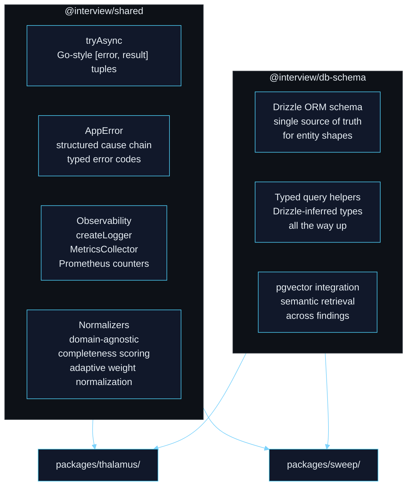

### 5-layer architecture (per feature package)

```mermaid
%%{init: {'theme':'base','themeVariables':{'background':'#0b0f17','primaryColor':'#11182a','primaryTextColor':'#e6edf3','primaryBorderColor':'#4cc9f0','secondaryColor':'#1a2033','tertiaryColor':'#141a28','secondaryTextColor':'#e6edf3','tertiaryTextColor':'#e6edf3','noteTextColor':'#e6edf3','noteBkgColor':'#1a2033','noteBorderColor':'#4cc9f0','lineColor':'#7dd3fc','textColor':'#e6edf3','mainBkg':'#11182a','secondBkg':'#1a2033','clusterBkg':'#0d1320','clusterBorder':'#4cc9f0','titleColor':'#e6edf3','edgeLabelBackground':'#0b0f17','labelBoxBkgColor':'#11182a','labelBoxBorderColor':'#4cc9f0','labelTextColor':'#e6edf3','actorBkg':'#11182a','actorBorder':'#4cc9f0','actorTextColor':'#e6edf3','actorLineColor':'#7dd3fc','signalColor':'#e6edf3','signalTextColor':'#e6edf3','activationBkgColor':'#1a2033','activationBorderColor':'#4cc9f0','sequenceNumberColor':'#0b0f17','classText':'#e6edf3'}}}%%
flowchart LR
    classDef default fill:#11182a,stroke:#4cc9f0,stroke-width:1px,color:#e6edf3;
    Routes["Routes<br/>(HTTP boundary)"] --> Controllers["Controllers<br/>(parse + validate)"]
    Controllers --> Services["Services<br/>(business logic)"]
    Services --> Repositories["Repositories<br/>(Drizzle queries)"]
    Repositories --> Entities["Entities<br/>(DB schema)"]

    classDef boundary fill:#1a1a2e,stroke:#4cc9f0,color:#e6edf3
    classDef logic fill:#1a1a2e,stroke:#f72585,color:#e6edf3
    classDef data fill:#1a1a2e,stroke:#06d6a0,color:#e6edf3

    class Routes,Controllers boundary
    class Services logic
    class Repositories,Entities data
```

**Invariants:** no business logic in controllers or repositories. No `any`/`unknown` in repo signatures. Drizzle-inferred types end-to-end. Zod validation at the LLM I/O boundary.

---

## Design choices worth discussing

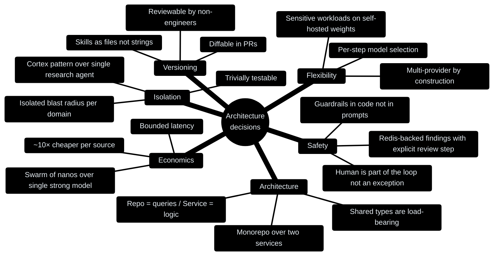

1. **Cortex pattern over a single "research agent"** — each cortex owns its tools, skills, SQL helpers. Isolated blast radius, parallel development, trivially testable.
2. **Swarm of nanos over a single strong model** — parallel cheap retrieval, stronger curator on the back end. Orders of magnitude cheaper, bounded latency, easier to cap.
3. **Skills as files, not strings** — version control for prompts, diffable in PRs, reviewable by analysts and compliance.
4. **Redis-backed findings with explicit review step** — Sweep doesn't write blindly. The human is part of the control loop, not an exception path.
5. **Repo = queries, service = logic** — strict separation. Repos do targeted joins; services aggregate and enforce rules. Layers are independently testable.
6. **Monorepo over two services** — shared types and schema are load-bearing. Versioning two npm packages would have bought pain, not isolation.
7. **Guardrails in code, not in prompts** — cost caps, depth limits, hallucination checks live in the orchestrator. The LLM cannot silently exceed its budget or leak sensitive data.
8. **Multi-provider by construction** — per-step model selection. Strong models on planning/synthesis, long-context open models (Kimi, Mistral, LLaMA) on reasoning, fleets of cheap nanos on retrieval. Sensitive workloads can be pinned to self-hosted weights without touching the orchestrator.

---

## Running locally

```bash
pnpm install
pnpm -r typecheck   # all packages
pnpm test           # vitest workspace (unit / integration / e2e)
pnpm run ssa        # conversational CLI (Ink REPL — see SSA console below)

make console        # Palantir-style operator UI on :5173 (+ console-api :4000)
```

External dependencies: Redis + Postgres for the backend services. The operator console (`apps/console/`) runs standalone against fixtures, no DB required.

### Full end-to-end SSA pipeline (live infra)

```bash
make up             # Postgres (pgvector) + Redis via docker-compose
make migrate        # Drizzle schema + enum prelude + HNSW halfvec(2048) index
make seed           # 33k-obj catalog (CelesTrak SATCAT) + Voyage-4-large
                    # embeddings (~$0.08) + SGP4 narrow-phase screen with
                    # Foster-1992 Pc on regime-conditioned σ

THALAMUS_MODE=record   make thalamus-cycle   # live LLMs, caches transcripts
THALAMUS_MODE=fixtures make thalamus-cycle   # replay from fixtures/recorded/, zero network
make sweep-run                               # nano-swarm audit + reviewer loop
make hooks-install                           # wire .githooks/pre-commit (spec-check + typecheck gate)
```

A fresh run from a clean volume produces `research_finding` rows with per-event titles (`NORAD 28252 × 38332 — 2.1 km miss, 2026-04-17T14:12Z, Pc=1.8e-04`), `research_edge` rows binding each finding to both satellites, and an `hnsw halfvec_cosine_ops` index serving semantic dedup at 2048-dim.

---

## SSA console — `pnpm run ssa`

Interactive terminal REPL (`@interview/cli`) with two-lane routing: explicit slash commands bypass the LLM (`parseExplicitCommand`), free-text goes through the `interpreter` cortex which emits a Zod-validated `RouterPlan { steps[1..8], confidence }`. Ambiguous input triggers a `clarify` step instead of guessing.

Commands:

- `/query <text>` — run a Thalamus cycle, render briefing
- `/telemetry <satId>` — spawn telemetry swarm, render 14-scalar distribution
- `/logs [level=info] [service=*]` — tail in-process pino ring buffer
- `/graph <entity>` — BFS neighbourhood in `research_edge`
- `/accept <suggestionId>` — resolve a sweep suggestion (audited)
- `/explain <findingId>` — ASCII provenance tree (finding → edges → source_item + skill sha256)

Rendering: editorial tight layout (pretext-flavored quote bubbles, confidence sparklines, source-class colors FIELD=green / OSINT=yellow / SIM=gray), animated emoji lifecycle logs at 6 fps, ASCII satellite loader with rolling p50/p95 ETA per `{kind, subject}` persisted to `~/.cache/ssa-cli/eta.json`, persistent status footer (`session · tokens k/400k · cost $X · last: …`).

Current boot is stub mode (`buildRealAdapters` throws for thalamus / telemetry / graph / resolution / why — real infra wiring pending). The `logs` adapter is real (pino ring buffer). Injectable adapters via `BootDeps` power the e2e test.

---

## Operator console — `apps/console/`

Vite + React + TypeScript · three modes on a shared Palantir-calibrated shell:

- **OPS** — wireframe globe (react-three-fiber + drei) with satellites propagated from Keplerian elements and conjunction arcs colored by Pc band. Click a satellite → drawer with orbital elements and active conjunctions.
- **THALAMUS** — Knowledge graph (sigma.js + ForceAtlas2 via webworker). Nodes by entity class (Satellite / Operator / Payload / OrbitRegime / ConjunctionEvent / Maneuver), edges colored by provenance (OSINT / Field / derived), widths weighted by confidence.
- **SWEEP** — dense findings graph with `Overview | Map | Stats` tabs. Nodes colored by decision status (pending / accepted / rejected / in-review), edges by co-citation. Accept / reject / review with reason, optimistic update, audit written.

Design system locked in [design-system/MASTER.md](design-system/MASTER.md); per-mode overrides in [design-system/pages/](design-system/pages/). Palette, typography, spacing, anti-patterns calibrated to Palantir Gotham — not a SaaS product.

Fixtures in [apps/console-api/src/fixtures.ts](apps/console-api/src/fixtures.ts) seed 600 satellites, 180 conjunctions, 226 KG nodes, 420 edges, 1200 findings deterministically — demo boots without Postgres. Swap the fixture module for real Drizzle queries when wiring to production data.

---

## What's been trimmed

Frontend beyond the console, ingestion pipelines, voice agent, multi-tenant / billing concerns — removed to keep the read focused on the design. Proprietary data, client identifiers, production secrets: sanitized. The public code is the architecture.

---

## References

| Author(s)            | Work                                                         | Year      |
| -------------------- | ------------------------------------------------------------ | --------- |
| Karpathy, A.         | _Software 2.0_                                               | 2017      |
| Karpathy, A.         | _Intro to Large Language Models_; nanoGPT                    | 2022–2023 |
| Shazeer et al.       | _Outrageously Large Neural Networks: Sparsely-Gated MoE_     | 2017      |
| Fedus, Zoph, Shazeer | _Switch Transformer_                                         | 2021      |
| Yao et al.           | _ReAct: Synergizing Reasoning and Acting in LMs_             | 2022      |
| Park et al.          | _Generative Agents: Interactive Simulacra of Human Behavior_ | 2023      |
| Christiano et al.    | _Deep RL from Human Preferences_                             | 2017      |
| Ouyang et al.        | _InstructGPT_                                                | 2022      |
| Huyen, C.            | _Designing Machine Learning Systems_ (O'Reilly)              | 2022      |
| Willison, S.         | LLM tool use, prompt injection, typed boundaries             | 2023–     |

---

## See also

- [TODO.md](TODO.md) — extraction state + planned test coverage
- [CHANGELOG.md](CHANGELOG.md) — extraction history
- [apps/console-api/src/agent/ssa/skills/](apps/console-api/src/agent/ssa/skills/) — SSA skill prompts as markdown
- [docs/specs/thalamus/dual-stream-confidence.tex](docs/specs/thalamus/dual-stream-confidence.tex) — SPEC-TH-040
- [docs/specs/thalamus/field-correlation.tex](docs/specs/thalamus/field-correlation.tex) — SPEC-TH-041
