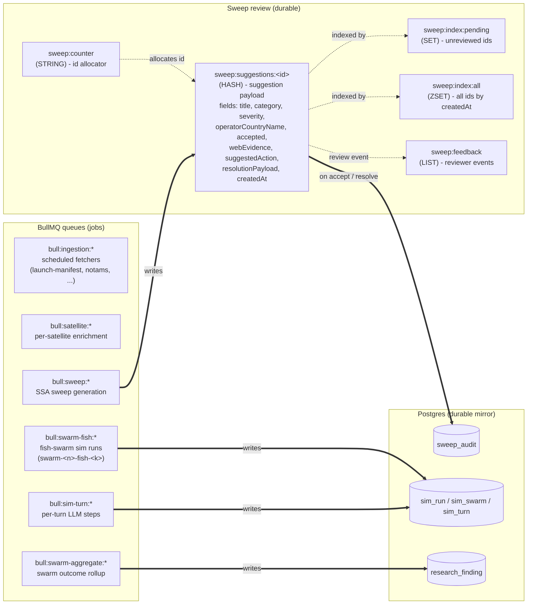

# Thalamus Data Stores — Live Schema (2026-04-17)

Generated by introspecting the running `thalamus-postgres` (pgvector/pg16) and
`thalamus-redis` (redis 7) containers from `docker-compose.yml`.

## Postgres — ER diagram

32 tables grouped by domain. Edges are real `FOREIGN KEY` constraints from
`information_schema`. JSONB / vector / array columns are kept where they shape
the model.

```mermaid
erDiagram
    %% =========================
    %% SSA CATALOG (domain core)
    %% =========================
    operator_country ||--o{ satellite : "operator_country_id"
    operator_country ||--o{ sweep_audit : "operator_country_id"
    operator_country }o--|| orbit_regime : "orbit_regime_id"
    operator         ||--o{ satellite : "operator_id"
    operator         ||--o{ sim_agent : "operator_id"
    platform_class   ||--o{ satellite : "platform_class_id"
    satellite_bus    ||--o{ satellite : "satellite_bus_id"
    satellite        ||--o{ satellite_payload : "satellite_id"
    payload          ||--o{ satellite_payload : "payload_id"
    satellite        ||--o{ tle_history : "satellite_id"
    satellite        ||--o{ amateur_track : "resolved_satellite_id"
    orbit_regime     ||--o{ amateur_track : "orbit_regime_id"
    source           ||--o{ amateur_track : "source_id"
    source           ||--o{ source_item : "source_id"
    satellite        ||--o{ conjunction_event : "primary_satellite_id"
    satellite        ||--o{ conjunction_event : "secondary_satellite_id"

    %% =========================
    %% RESEARCH / KNOWLEDGE GRAPH
    %% =========================
    research_cycle          ||--o{ research_cycle_finding : "research_cycle_id"
    research_finding        ||--o{ research_cycle_finding : "research_finding_id"
    research_cycle          ||--o{ research_finding       : "research_cycle_id (legacy)"
    research_finding        ||--o{ research_edge          : "finding_id"

    %% =========================
    %% SIMULATION (fish swarms)
    %% =========================
    sim_swarm        ||--o{ sim_run          : "swarm_id"
    sim_run          ||--o{ sim_agent        : "sim_run_id"
    sim_run          ||--o{ sim_turn         : "sim_run_id"
    sim_run          ||--o{ sim_agent_memory : "sim_run_id"
    sim_agent        ||--o{ sim_agent_memory : "agent_id"
    sim_agent        ||--o{ sim_turn         : "agent_id"
    research_finding ||--o{ sim_run          : "report_finding_id"
    research_finding ||--o{ sim_swarm        : "outcome_report_finding_id"

    %% =========================
    %% USERS / CONTENT
    %% =========================
    user ||--o{ article        : "author_id"
    user ||--o{ research_cycle : "user_id (no FK)"

    %% =========================
    %% IMPLICIT FKs (no DB constraint, resolved by enrichment pipeline)
    %% Dashed lines = denormalized text/integer columns from external feeds
    %% =========================
    satellite        ||..o{ fragmentation_event : "parent_norad_id (int, no FK)"
    operator_country ||..o{ fragmentation_event : "parent_operator_country (ISO2 text)"
    orbit_regime     ||..o{ fragmentation_event : "regime_name (code text)"
    operator         ||..o{ launch              : "operator_name (text)"
    operator_country ||..o{ launch              : "operator_country (ISO2 text)"
    orbit_regime     ||..o{ launch              : "orbit_name (code text)"
    operator         ||..o{ itu_filing          : "operator_name (text, n-n)"
    operator_country ||..o{ itu_filing          : "operator_country (ISO2 text)"

    operator_country {
        bigint id PK
        text   name
        text   slug
        bigint orbit_regime_id FK
        jsonb  doctrine
        jsonb  bounds
        jsonb  centroid
        jsonb  geometry
    }
    operator {
        bigint id PK
        text   name
        text   slug
        real   latitude
        real   longitude
        text   ground_station
    }
    orbit_regime {
        bigint id PK
        text   name
        text   altitude_band
        jsonb  baselines
    }
    platform_class {
        bigint id PK
        text   name
    }
    satellite_bus {
        bigint id PK
        text   name
        text   platform_class
        text   generation
        jsonb  payloads
        jsonb  telemetry_summary
        real   power_draw
        real   thermal_margin
        real   pointing_accuracy
    }
    payload {
        bigint id PK
        text   name
        text   slug
        jsonb  technical_profile
    }
    satellite {
        bigint  id PK
        text    name
        text    slug
        integer launch_year
        bigint  operator_country_id FK
        bigint  platform_class_id FK
        bigint  operator_id FK
        bigint  satellite_bus_id FK
        integer norad_id
        text    object_class
        real    mass_kg
        text    classification_tier
        jsonb   descriptions
        jsonb   profile_metadata
        jsonb   telemetry_summary
        vector  embedding
        text    embedding_model
    }
    satellite_payload {
        bigint satellite_id FK
        bigint payload_id FK
        text   role
        real   mass_kg
        real   power_w
    }
    tle_history {
        bigint  id PK
        bigint  satellite_id FK
        integer norad_id
        ts      epoch
        real    mean_motion
        real    eccentricity
        real    inclination_deg
    }
    amateur_track {
        bigint  id PK
        bigint  source_id FK
        bigint  orbit_regime_id FK
        bigint  resolved_satellite_id FK
        ts      observed_at
        integer candidate_norad_id
        text    citation_url
    }
    conjunction_event {
        bigint id PK
        bigint primary_satellite_id FK
        bigint secondary_satellite_id FK
        ts     epoch
        real   min_range_km
        real   probability_of_collision
        text   pc_method
    }
    fragmentation_event {
        bigint  id PK
        integer parent_norad_id
        text    parent_name
        ts      date_utc
        text    event_type
    }
    space_weather_forecast {
        bigint id PK
        ts     epoch
        real   f107
        real   ap_index
        real   kp_index
    }
    itu_filing {
        bigint  id PK
        text    filing_id
        text    constellation_name
        text    administration
        text    orbit_class
        integer planned_satellites
        text[]  frequency_bands
        jsonb   raw
    }
    launch {
        bigint  id PK
        integer year
        text    name
        text    vehicle
        text    operator_name
        text    pad_name
        ts      planned_net
        text    status
        text    mission_name
        boolean rideshare
    }
    notam {
        bigint  id PK
        text    notam_id
        text    type
        ts      parsed_start_utc
        ts      parsed_end_utc
        boolean is_launch_related
    }

    source {
        bigint  id PK
        text    name
        text    slug
        text    kind
        text    url
        boolean is_enabled
        ts      last_fetched_at
    }
    source_item {
        bigint id PK
        bigint source_id FK
        text   external_id
        text   title
        text   abstract
        text   body
        text[] authors
        ts     published_at
    }

    research_cycle {
        bigint  id PK
        enum    trigger_type
        text    trigger_source
        bigint  user_id
        jsonb   dag_plan
        text[]  cortices_used
        enum    status
        integer findings_count
        real    total_cost
        ts      started_at
        ts      completed_at
    }
    research_finding {
        bigint  id PK
        bigint  research_cycle_id FK
        enum    cortex
        enum    finding_type
        enum    status
        enum    urgency
        text    title
        text    summary
        jsonb   evidence
        real    confidence
        real    impact_score
        integer iteration
        text    dedup_hash
        vector  embedding
        ts      expires_at
    }
    research_cycle_finding {
        bigint  research_cycle_id PK,FK
        bigint  research_finding_id PK,FK
        integer iteration
        boolean is_dedup_hit
    }
    research_edge {
        bigint id PK
        bigint finding_id FK
        enum   entity_type
        bigint entity_id
        enum   relation
        real   weight
        jsonb  context
    }
    exploration_log {
        bigint  id PK
        text    query
        text    query_type
        text    signal_source
        integer urls_crawled
        integer items_injected
        integer items_promoted
        real    quality_score
    }
    sweep_audit {
        bigint  id PK
        text    suggestion_id
        bigint  operator_country_id FK
        text    operator_country_name
        enum    category
        enum    severity
        text    title
        text    suggested_action
        integer affected_satellites
        boolean accepted
        enum    resolution_status
        jsonb   resolution_payload
    }

    sim_swarm {
        bigint  id PK
        text    kind
        text    title
        jsonb   base_seed
        jsonb   perturbations
        integer size
        text    status
        bigint  outcome_report_finding_id FK
        bigint  suggestion_id
    }
    sim_run {
        bigint  id PK
        bigint  swarm_id FK
        integer fish_index
        text    kind
        jsonb   seed_applied
        jsonb   perturbation
        text    status
        bigint  report_finding_id FK
        real    llm_cost_usd
    }
    sim_agent {
        bigint  id PK
        bigint  sim_run_id FK
        bigint  operator_id FK
        integer agent_index
        text    persona
        jsonb   goals
        jsonb   constraints
    }
    sim_agent_memory {
        bigint  id PK
        bigint  sim_run_id FK
        bigint  agent_id FK
        integer turn_index
        text    kind
        text    content
        vector  embedding
        ts      retired_at
    }
    sim_turn {
        bigint  id PK
        bigint  sim_run_id FK
        integer turn_index
        text    actor_kind
        bigint  agent_id FK
        jsonb   action
        text    rationale
        text    observable_summary
        real    llm_cost_usd
    }

    user {
        bigint id PK
        text   email
        text   name
        text   role
        text   tier
    }
    article {
        bigint id PK
        text   slug
        text   title
        text   status
        text   content
        bigint author_id FK
    }
```

## Schema debt — implicit FKs to fix

Audited 2026-04-17 by introspection + sampled distinct values. The dashed edges
in the diagram above are **not** declared in `information_schema`; they are
text/integer columns from external feeds that the enrichment pipeline resolves
later. They are listed here so they don't get lost.

### High confidence (mostly resolvable today)

| Source                                      | Target                  | Note                                                                            |
| ------------------------------------------- | ----------------------- | ------------------------------------------------------------------------------- |
| `fragmentation_event.parent_norad_id` (int) | `satellite.norad_id`    | ~65% match on current rows; rest needs TLE backfill                             |
| `tle_history.norad_id` (int)                | `satellite.norad_id`    | Pure denormalization next to the existing `satellite_id` FK — drop or constrain |
| `amateur_track.candidate_norad_id` (int)    | `satellite.norad_id`    | Pre-resolution column; `resolved_satellite_id` (FK) is the post-resolution one  |
| `sweep_audit.operator_country_name` (text)  | `operator_country.name` | Mirror of the existing `operator_country_id` FK — drop or expose as a view      |

### Medium confidence (needs catalogue change first)

| Source                                               | Target                      | Blocker                                                                                  |
| ---------------------------------------------------- | --------------------------- | ---------------------------------------------------------------------------------------- |
| `fragmentation_event.parent_operator_country` (text) | `operator_country.iso_code` | `operator_country` only stores long names; need an `iso_code UNIQUE` column              |
| `launch.operator_country` (text)                     | `operator_country.iso_code` | same                                                                                     |
| `itu_filing.operator_country` (text)                 | `operator_country.iso_code` | same                                                                                     |
| `launch.operator_name` (text)                        | `operator.name`             | ~55% match, naming drift; needs an alias table                                           |
| `itu_filing.operator_name` (text)                    | `operator.name`             | ~13% match, often consortia (`SpaceRISE consortium (...)`) — n-n junction table required |

### Low confidence (model gap)

| Source                                    | Target              | Note                                                                                                          |
| ----------------------------------------- | ------------------- | ------------------------------------------------------------------------------------------------------------- |
| `fragmentation_event.regime_name` (text)  | `orbit_regime.code` | `orbit_regime.name` stores long labels (`Geostationary Orbit`); add a `code` column (`GEO`, `LEO`...)         |
| `launch.orbit_name` (text)                | `orbit_regime.code` | same; plus out-of-vocabulary values (`Mars`, `L2`, `Sub`) need a separate model for translunar/interplanetary |
| `launch.pad_name` + `launch.pad_location` | (no table)          | Candidates for a new `launch_pad` catalogue                                                                   |
| `notam.facility` / `notam.state`          | (no table)          | FAA ARTCC codes (`ZMP`, `ZDC`) and US state codes — external catalogues, low priority                         |

### Genuine event-only tables (no FK expected)

- `space_weather_forecast` — pure time series (F10.7, Kp, Ap), no entity to link.
- `exploration_log` — crawler activity, doesn't identify a domain entity.
- External-id columns (`notam.notam_id`, `launch.external_launch_id`, `source_item.external_id`, `itu_filing.filing_id`) — upstream identifiers, never internal FKs.
- `research_cycle` — aggregate root, only points back to `user` (nullable, no FK).
- `fragmentation_event` rows where `parent_norad_id` is unknown stay legitimately orphan with only `parent_name` (text).

**Dominant pattern**: the catalogue stores long labels; external sources use
ISO2 codes / abbreviations. Before adding any FK, enrich `operator_country` and
`orbit_regime` with `iso_code` / `code UNIQUE` columns and point the FKs there.

## Redis — keyspace map

`thalamus-redis` (DB 0, ~2.7k keys). Two distinct workloads share the instance:
the **sweep review queue** (durable hashes + indices) and **BullMQ** queues for
async pipelines.

### Key conventions

| Pattern                  | Type           | Purpose                                                       | Persistence                  |
| ------------------------ | -------------- | ------------------------------------------------------------- | ---------------------------- |
| `sweep:counter`          | STRING         | monotonic id source for sweep suggestions                     | AOF (durable)                |
| `sweep:suggestions:<id>` | HASH           | full suggestion record (mirrored to `sweep_audit` on resolve) | AOF + 7d TTL on some entries |
| `sweep:index:pending`    | SET            | ids awaiting reviewer                                         | AOF                          |
| `sweep:index:all`        | ZSET           | createdAt-scored index                                        | AOF                          |
| `sweep:feedback`         | LIST           | reviewer feedback events consumed by sweep loop               | AOF                          |
| `bull:<queue>:<jobId>`   | HASH/ZSET/LIST | BullMQ internals (waiting/active/delayed/repeat)              | AOF                          |

Redis is configured with `--save 60 1 --appendonly yes` so both workloads
survive restarts; the Postgres tables above remain the source of truth, Redis
is the **ingestion + review buffer**.
